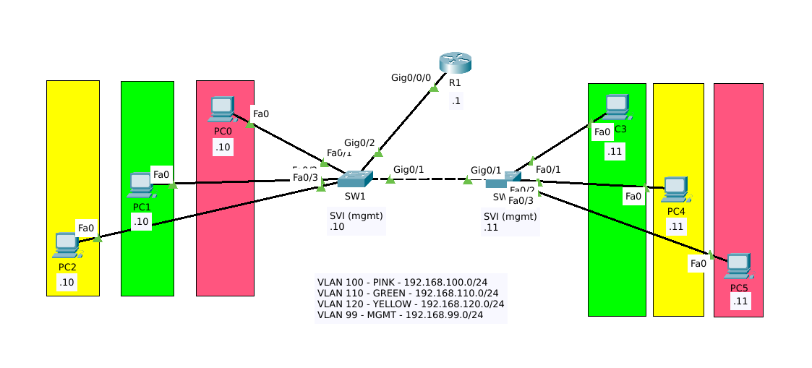
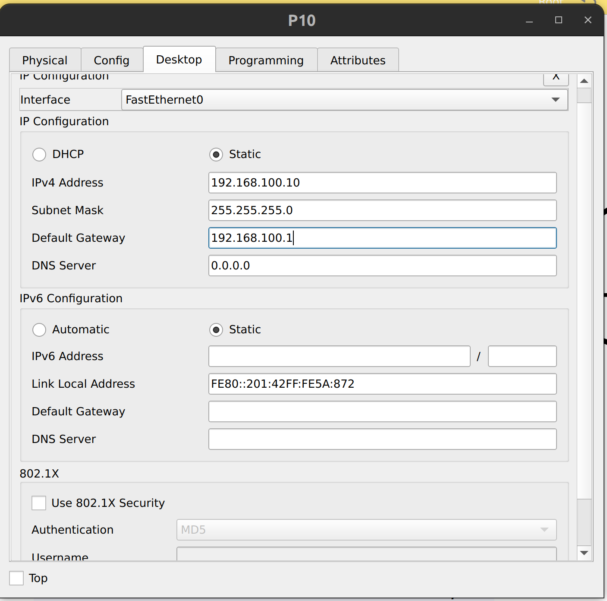
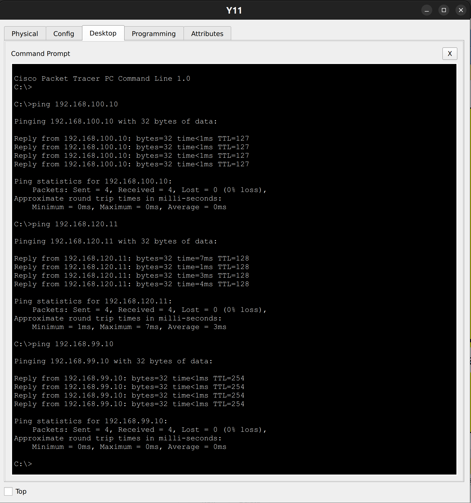
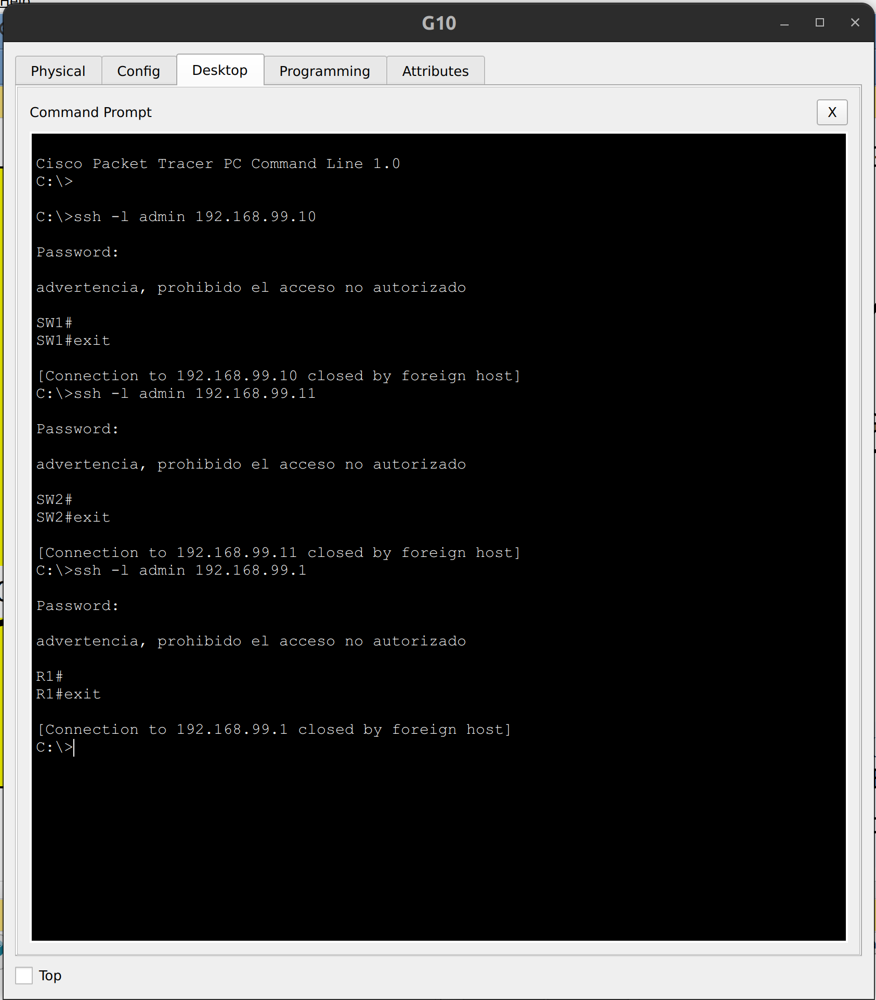

# CCNA Lab - Inter Vlan Routing - Router-on-Stick Part 1/2

## Objetivo

El proposito de este laboratorio es configurar una red con 3 VLANs identificadas cada una por un color y 1 VLAN adicional para la administración de los equipos de red. Para el enrutamiento Inter VLAN se utiliza un router con sub-interfaces, una para cada VLAN, lo que comunmente se conoce como Router-on-Stick. Adicionalmente se deben configurar los parametros iniciales de los dispositivos de red.

## Topología 



## Archivo de PT
Configuración [final](labs/ccna-lab-intervlan-ros-answer.pkt)

## Información General

#### Tabla de VLANs
    
| Vlan ID    | Name      | Subnet           |
| ---------- |:---------:| ----------------:|
| 100       | pink      | 192.168.100.0/24 |
| 110        | green     | 192.168.110.0/24 |
| 120        | yellow    | 192.168.120.0/24 |
| 99         | mgmt      | 192.168.99.0./24 |

#### Asignación de puertos y direccionamiento IP
    
| Device   | Port   | Port Type | Vlan(s)   | IP address   |
| -------- |:------:| :--------:|:------:|------------  |
| SW1      | Fa0/1  | Access    | pink   |              |
| SW1      | Fa0/2  | Access    | green  |              |
| SW1      | Fa0/3  | Access    | yellow |              |
| SW1      | SVI    | Access    | mgmt   |192.168.99.10 |
| SW1      | Gi0/1  | Trunk     | ALL   ||
| SW1      | Gi0/2  | Trunk     | ALL   ||
| SW2      | Fa0/1  | Access    | green  |              |
| SW2      | Fa0/2  | Access    | yellow |              |
| SW2      | Fa0/3  | Access    | pink   |              |
| SW2      | SVI    | Access    | mgmt   | 192.168.99.11|
| SW2      | Gi0/1  | Trunk     | ALL   ||
| R1      | Gi0/0/0.100 | Trunk | pink   | 192.168.100.1|
| R1       | Gi0/0/0.110 | Trunk | green | 192.168.110.1|
| R1       | Gi0/0/0.120 | Trunk | yellow| 192.168.120.1|
| R1       | Gi0/0/0.99  | Trunk | mgmt  | 192.168.99.1| 
| P10      | eth  | Access | pink  | 192.168.100.10| 
| G10      | eth  | Access | green  | 192.168.110.10| 
| Y10      | eth  | Access | yellow  | 192.168.120.10| 
| P11      | eth  | Access | pink  | 192.168.100.11| 
| G11      | eth  | Access | green  | 192.168.110.11| 
| Y11      | eth  | Access | yellow  | 192.168.120.11| 


## Instrucciones

### Parte 1: Parametros iniciales
- En todos los dispositivos, configure el nombre de host,
- Configure un mensaje del dia que contenga la palabra `advertencia`
- Proteja el acceso a consola con el password `cisco`
- Proteja el acceso a EXE privilegiado con `class`
- Encripte las contraseñas en el archivo de configuración
  
### Parte 2: Acceso por SSH 
   - Configure un nombre de dominio `mylab.com`
   - Genere un par de llaves RSA con **1024bits** para habilitar SSH.
   - Cree un usuario `admin` con contraseña segura `letmein` y el **máximo** privilegio
   - Habilite el acceso por SSH en todas las terminales virtuales disponibles, asegurese de utilizar la base de datos local para la autenticación de usuarios.
   - Asegurese de estar utilizndo la version 2 del protocolo

### Parte 3: VLANs y puertos de switch

- Configure las VLANs en SW1 y SW2 de acuerdo ala información proporcionada en [tabla de vlans](#tabla-de-vlans)
  
- Configure los puertos de acceso en SW1 y SW2 según la información proporcionada en la [tabla de asignación de puertos](#asignación-de-puertos-y-direccionamiento-ip) 

- Configure los enlaces troncales en SW1 y SW2 de acuerdo con la [tabla de asignación de puertos](#asignación-de-puertos-y-direccionamiento-ip). ***Unicamente debe permitir el tráfico de las vlans utilizadas en el ejercicio y rechazar cualquier trafico que pertenezca a otra VLAN.***

- Habilite las interfaces de administración en SW1 y SW2 y asigne las direcciónes IP, de acuerdo con la información [proporcionada](#asignación-de-puertos-y-direccionamiento-ip).
- Configure lo necesario para que el switch puede ser alcanzado desde redes externas

 ### Parte 4: Enrutamiento inter vlan
 - Configure en enrutamiento inter-vlan colocando la interfaz del router como puerto troncal mediante sub-interfaces y asigne las direcciónes IP según lo indicado en la [tabla](#asignación-de-puertos-y-direccionamiento-ip), no olvide habilitar la interfaz principal.

### Parte 5: Direcciones de los hosts
- Asigne las direcciones IP a las PC's de acuerdo a la información [proporcionada](#asignación-de-puertos-y-direccionamiento-ip) 

### Parte 6: Pruebas
- Si realizó toda la configuración correctamente, debe de poder hacer ping desde cualquier computadora a los demas host, incluyendo las SVI de los switches y las interfaces del router.
- Debe poder acceder por SSH a los switches y al router desde cualquier computadora.

## Solución Paso a Paso

### Parte 1: Parametros iniciales

**SW1:**
```text
Switch>
Switch>enable
Switch#configure terminal
Enter configuration commands, one per line.  End with CNTL/Z.
Switch(config)#hostname SW1
SW1(config)#banner motd "advertencia, prohibido el acceso no autorizado"
SW1(config)#line console 0
SW1(config-line)#password cisco
SW1(config-line)#login
SW1(config-line)#exit
SW1(config)#enable secret class
SW1(config)#service password-encryption

```

**SW2:**
```
Switch>
Switch>enable
Switch#configure terminal
Enter configuration commands, one per line.  End with CNTL/Z.
Switch(config)#hostname SW2
SW2(config)#banner motd "advertencia, prohibido el acceso no autorizado"
SW2(config)#line console 0
SW2(config-line)#password cisco
SW2(config-line)#login
SW2(config-line)#exit
SW2(config)#enable secret class
SW2(config)#service password-encryption
SW2(config)#
```

**R1:**
```
Router>
Router>enable
Router#configure terminal
Enter configuration commands, one per line.  End with CNTL/Z.
Router(config)#hostname R1
R1(config)#banner motd "advertencia, prohibido el acceso no autorizado"
R1(config)#line console 0
R1(config-line)#password cisco
R1(config-line)#login
R1(config-line)#exit
R1(config)#enable secret class
R1(config)#service password-encryption
R1(config)#
R1(config)#
```

### Parte 2: Acceso por SSH 

**SW1, SW2 y R1:**
```text
SW1#
SW1#configure terminal
Enter configuration commands, one per line.  End with CNTL/Z.
SW1(config)#ip domain-name mylab.com
SW1(config)#username admin secret letmein
SW1(config)#username admin privilege 15
SW1(config)#crypto key generate rsa 
The name for the keys will be: SW1.mylab.com
Choose the size of the key modulus in the range of 360 to 2048 for your
  General Purpose Keys. Choosing a key modulus greater than 512 may take
  a few minutes.

How many bits in the modulus [512]: 1024
% Generating 1024 bit RSA keys, keys will be non-exportable...[OK]
SW1(config)#line vty 0 15
*Mar 1 0:22:5.144: %SSH-5-ENABLED: SSH 1.99 has been enabled
SW1(config-line)#transport input ssh
SW1(config-line)#login local
SW1(config-line)#exit
SW1(config)#ip ssh version 2
SW1(config)#
```

### Parte 3: VLANs y puertos de switch
- Configure las VLANs en SW1 y SW2 de acuerdo ala información proporcionada en [tabla de vlans](#tabla-de-vlans)

```
SW1#configure terminal
Enter configuration commands, one per line.  End with CNTL/Z.
SW1(config)#vlan 101
SW1(config-vlan)#name pink
SW1(config-vlan)#exit
SW1(config)#vlan 110
SW1(config-vlan)#name green
SW1(config-vlan)#exit
SW1(config)#vlan 120
SW1(config-vlan)#name yellow
SW1(config-vlan)#exit
SW1(config)#vlan 99
SW1(config-vlan)#name mgmt
SW1(config-vlan)#exit
SW1(config)#
```

```
SW2#
SW2#configure terminal
Enter configuration commands, one per line.  End with CNTL/Z.
SW2(config)#vlan 101
SW2(config-vlan)#name pink
SW2(config-vlan)#exit
SW2(config)#vlan 110
SW2(config-vlan)#name green
SW2(config-vlan)#exit
SW2(config)#vlan 120
SW2(config-vlan)#name yellow
SW2(config-vlan)#exit
SW2(config)#vlan 99
SW2(config-vlan)#name mgmt
SW2(config-vlan)#exit
SW2(config)#
```

- Configure los puertos de acceso en SW1 y SW2 según la información proporcionada en la [tabla de asignación de puertos](#asignación-de-puertos-y-direccionamiento-ip) 


```
SW1(config)#
SW1(config)#interface fa0/1
SW1(config-if)#switchport mode access
SW1(config-if)#switchport access vlan 100
SW1(config-if)#exit
SW1(config)#interface fa0/2
SW1(config-if)#switchport mode access
SW1(config-if)#switchport access vlan 110
SW1(config-if)#exit
SW1(config)#interface fa0/3
SW1(config-if)#switchport mode access
SW1(config-if)#switchport access vlan 120
SW1(config-if)#exit
SW1(config)#
```

```
SW2(config)#
SW2(config)#interface f0/1
SW2(config-if)#switchport mode access
SW2(config-if)#switchport access vlan 110
SW2(config-if)#exit
SW2(config)#interface fa0/2
SW2(config-if)#switchport mode access
SW2(config-if)#switchport access vlan 120
SW2(config-if)#exit
SW2(config)#interface f0/3
SW2(config-if)#switchport mode access
SW2(config-if)#switchport access vlan 100
SW2(config-if)#exit
SW2(config)#

```

- Configure los enlaces troncales en SW1 y SW2 de acuerdo con la [tabla de asignación de puertos](#asignación-de-puertos-y-direccionamiento-ip). ***Unicamente debe permitir el tráfico de las vlans utilizadas en el ejercicio y rechazar cualquier trafico que pertenezca a otra VLAN.***

```
SW1(config)#
SW1(config)#interface g0/1
SW1(config-if)#switchport mode trunk
SW1(config-if)#switchport trunk allowed vlan 100,110,120,99
SW1(config-if)#exit
SW1(config)#
SW1(config)#interface g0/2
SW1(config-if)#switchport mode trunk
SW1(config-if)#switchport trunk allowed vlan 100,110,120,99
SW1(config-if)#exit
SW1(config)#
```

```
SW2(config)#
SW2(config)#interface g0/1
SW2(config-if)#switchport mode trunk
SW2(config-if)#switchport trunk allowed vlan 100,110,120,99
SW2(config-if)#exit
SW2(config)#
```


- Habilite las interfaces de administración en SW1 y SW2 y asigne las direcciónes IP, de acuerdo con la información [proporcionada](#asignación-de-puertos-y-direccionamiento-ip). 
- Configure lo necesario para que el switch puede ser alcanzado desde redes externas

```
SW1(config)#
SW1(config)#interface vlan 99
SW1(config-if)#ip address 192.168.99.10 255.255.255.0
SW1(config-if)#no shutdown
SW1(config-if)#exit
SW1(config)#ip default-gateway 192.168.99.1
SW1(config)#
```

```
SW2(config)#
SW2(config)#interface vlan 99
SW2(config-if)#ip address 192.168.99.11 255.255.255.0
SW2(config-if)#no shutdown
SW2(config-if)#exit
SW2(config)#ip default-gateway 192.168.99.1
SW2(config)#
```

 ### Parte 4: Enrutamiento inter vlan

- Configure en enrutamiento inter-vlan colocando la interfaz del router como puerto troncal mediante sub-interfaces y asigne las direcciónes IP según lo indicado en la [tabla](#asignación-de-puertos-y-direccionamiento-ip), no olvide habilitar la interfaz principal.
 
```
R1(config)#
R1(config)#interface G0/0/0.100
R1(config-subif)#encapsulation dot1q 100
R1(config-subif)#ip address 192.168.100.1 255.255.255.0
R1(config-subif)#exit
R1(config)#interface G0/0/0.110
R1(config-subif)#encapsulation dot1q 110
R1(config-subif)#ip address 192.168.110.1 255.255.255.0
R1(config-subif)#exit
R1(config)#interface G0/0/0.120
R1(config-subif)#encapsulation dot1q 120
R1(config-subif)#ip address 192.168.120.1 255.255.255.0
R1(config-subif)#exit
R1(config)#interface G0/0/0.99
R1(config-subif)#encapsulation dot1q 99
R1(config-subif)#ip address 192.168.99.1 255.255.255.0
R1(config-subif)#exit
R1(config)#interface G0/0/0
R1(config-if)#no shutdown
R1(config-if)#

```

### Parte 5: Direcciones de los hosts
- Asigne las direcciones IP a las PC's de acuerdo a la información [proporcionada](#asignación-de-puertos-y-direccionamiento-ip) 

**Ejemplo P10**



### Parte 6: Pruebas

**Prueba de Ping**


**Prueba de SSH**



    
    


