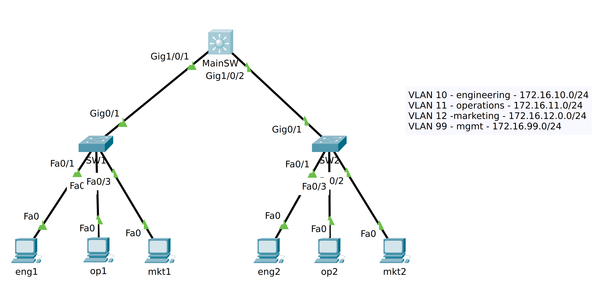
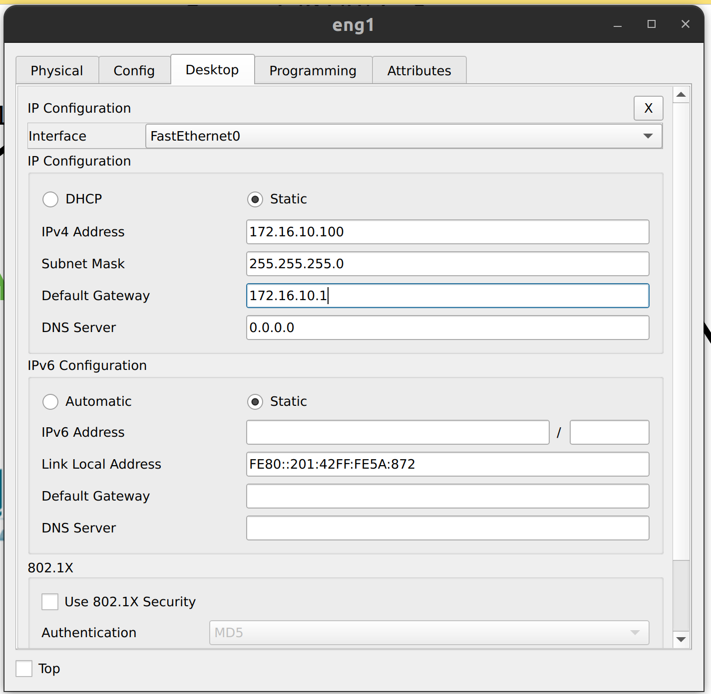
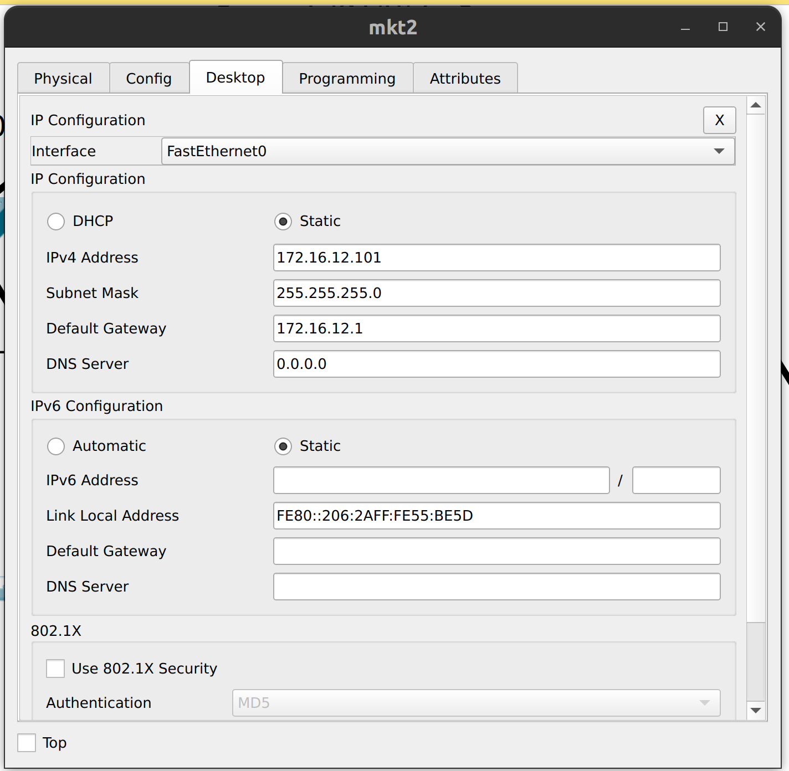
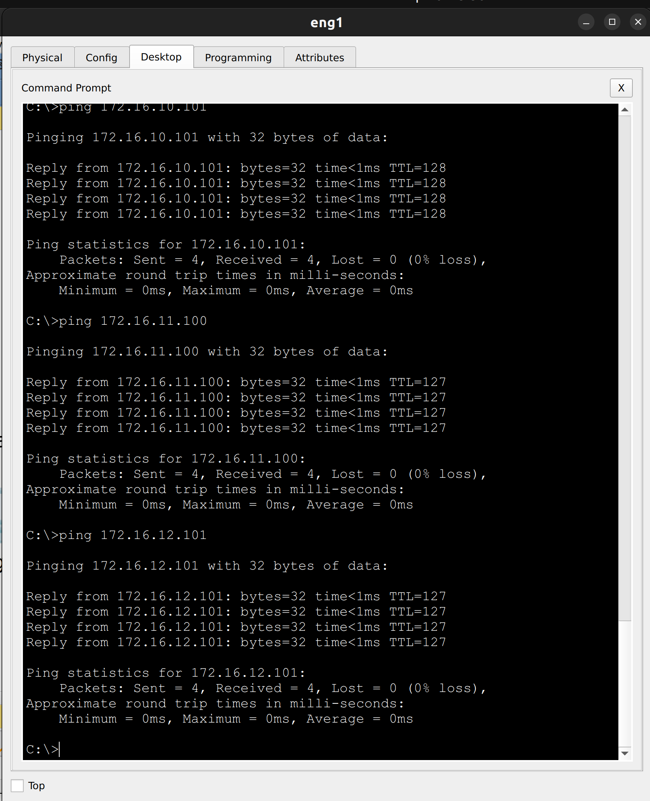
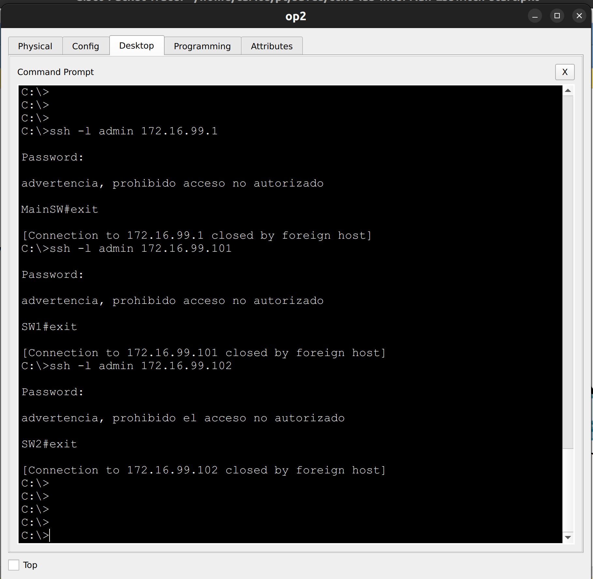

# CCNA Lab - Inter Vlan Routing - Multilayer Switch (SVIs)

## Objetivo

El proposito de este laboratorio es configurar una red con 3 VLANs, una por departamento de la organización y 1 VLAN adicional para la administración de los equipos de red (mgmt). Para el enrutamiento Inter VLAN se tiene un switch multilayer (L2/L3) con SVI's configuradas en cada VLAN.

## Topología 




## Archivo de PT

Este es el laboratorio con la [configuración final](labs/ccna-lab-intervlan-L3switch-answer.pkt)

## Información General

### Tabla de VLANs
    
| Vlan ID  | Name        | Subnet         |
| -------- |:-----------:| --------------:|
| 10       | engineering | 172.16.10.0/24 |
| 11       | operations  | 172.16.11.0/24 |
| 12       | markeing    | 172.16.11.0/24 |
| 99       | mgmt        | 172.16.99.0/24 |

### Asignación de puertos y direccionamiento IP
    
| Device   | Port         | Port Type | Vlan(s)     | IP address   |
| -------- |:---------:   | :--------:|:-----------:|------------  |
| SW1      | Fa0/1-5      | Access    | engineering |              |
| SW1      | Fa0/6-10     | Access    | operations  |              |
| SW1      | Fa0/11-15    | Access    | marketing   |              |
| SW1      | VLAN 99      | Route     | mgmt        |172.16.99.101 |
| SW1      | Gi0/1        | Trunk     | ALL         |              |
| SW2      | Fa0/1-5      | Access    | engineering |              |
| SW2      | Fa0/6-10     | Access    | operations  |              |
| SW2      | Fa0/11-15    | Access    | marketing   |              |
| SW2      | VLAN 99      | Route     | mgmt         | 172.16.99.102|
| SW2      | Gi0/1        | Trunk     | ALL         |              |
| MainSW      | Gi1/0/1      | Trunk     | ALL         |              |
| MainSW      | Gi1/0/2      | Trunk     | ALL         |              |
| MainSW      | VLAN 10      | Route     | engineering | 172.16.10.1  |
| MainSW      | VLAN 11      | Route     | operations  | 172.16.11.1 |
| MainSW      | VLAN 12      | Route     | marketing   | 172.16.12.1  |
| MainSW      | VLAN 99      | Route     | mgmt        | 172.16.99.1  |
| eng1    | eth  | Access | engineering  | 172.16.10.100| 
| eng2    | eth  | Access | engineering  | 172.16.10.101| 
| op1     | eth  | Access | operations   | 172.16.11.100| 
| op2     | eth  | Access | operations   | 172.16.11.101| 
| mkt1    | eth  | Access | marketing    | 172.16.12.100| 
| mkt2    | eth  | Access | marketing    | 172.16.12.101| 


## Instrucciones

### Parte 1: Parametros iniciales
- En todos los dispositivos, configure el nombre de host,
- Configure un mensaje del dia que contenga la palabra `advertencia`
- Proteja el acceso a consola con el password `cisco`
- Proteja el acceso a EXE privilegiado con `class`
- Encripte las contraseñas en el archivo de configuración
  
### Parte 2: Acceso por SSH 
   - Configure un nombre de dominio `mylab.com`
   - Genere un par de llaves RSA con **1024 bits** para habilitar SSH.
   - Cree un usuario `admin` con contraseña segura `letmein` y el **máximo** privilegio
   - Habilite el acceso por SSH en todas las terminales virtuales disponibles, asegurese de utilizar la base de datos local para la autenticación de usuarios.
   - Asegurese de estar utilizndo la version 2 del protocolo

### Parte 3: VLANs y puertos de switch

- Configure las VLANs en SW1, SW2 y MainSW de acuerdo a la información proporcionada en [tabla de vlans](#tabla-de-vlans)
  
- Configure los puertos de acceso en SW1 y SW2 según la información proporcionada en la [tabla de asignación de puertos](#asignación-de-puertos-y-direccionamiento-ip) 

- Configure los enlaces troncales en SW1, SW2 y MainSW de forma estática, de acuerdo con la [tabla de asignación de puertos](#asignación-de-puertos-y-direccionamiento-ip). ***Unicamente debe permitir el tráfico de las vlans utilizadas en el ejercicio y rechazar cualquier trafico que pertenezca a otra VLAN.***

- Habilite las interfaces de administración en SW1 y SW2 y asigne las direcciónes IP, de acuerdo con la información [proporcionada](#asignación-de-puertos-y-direccionamiento-ip).
  
- Configure lo necesario para que el switch puede ser alcanzado desde redes externas

 ### Parte 4: Enrutamiento inter vlan
 - Habilite el enrutamiento inter-vlan en MainSW mediante la configuración de las SVIs correspondientes, según lo indicado en la [tabla](#asignación-de-puertos-y-direccionamiento-ip), no olvide habilitar en enrutamiento IPv4 en el router multicapa.

### Parte 5: Direcciones de los hosts
- Asigne las direcciones IP a las PC's de acuerdo a la información [proporcionada](#asignación-de-puertos-y-direccionamiento-ip) 

### Parte 6: Pruebas
- Si realizó toda la configuración correctamente, debe de poder hacer ping desde cualquier computadora a los demas host, incluyendo las SVI de los switches y las interfaces del router.
- Debe poder acceder por SSH a los switches y al router desde cualquier computadora.

## Solución paso a paso

### Parte 1: Parametros iniciales (opcional)

**SW1:**

```text
Switch>
Switch>enable
Switch#configure terminal
Enter configuration commands, one per line.  End with CNTL/Z.
Switch(config)#hostname SW1
SW1(config)#banner motd "advertencia, prohibido acceso no autorizado"
SW1(config)#line console 0
SW1(config-line)#password cisco
SW1(config-line)#login
SW1(config-line)#exit
SW1(config)#enable secret class
SW1(config)#service password-encryption 
SW1(config)#exit
SW1#
```

**SW2:**

```text
Switch>
Switch>enable
Switch#configure terminal
Enter configuration commands, one per line.  End with CNTL/Z.
Switch(config)#hostname SW2
SW2(config)#banner motd "advertencia, prohibido el acceso no autorizado"
SW2(config)#line console 0
SW2(config-line)#password cisco
SW2(config-line)#login
SW2(config-line)#exit
SW2(config)#enable secret class
SW2(config)#service password-encryption
SW2(config)#exit
SW2#
```  

**MainSW:**

```text
Switch>
Switch>enable
Switch#configure terminal
Enter configuration commands, one per line.  End with CNTL/Z.
Switch(config)#hostname MainSW
MainSW(config)#banner motd "advertencia, prohibido acceso no autorizado"
MainSW(config)#line console 0
MainSW(config-line)#password cisco
MainSW(config-line)#login
MainSW(config-line)#exit
MainSW(config)#enable secret class
MainSW(config)#service password-encryption 
MainSW(config)#
MainSW(config)#exit
MainSW#
```

### Parte 2: Acceso por SSH 

**SW1, SW2 y MainSW:**

```
MainSW#
MainSW#configure terminal
MainSW(config)#ip domain-name mylab.com
MainSW(config)#crypto key generate rsa
The name for the keys will be: MainSW.mylab.com
Choose the size of the key modulus in the range of 360 to 2048 for your
  General Purpose Keys. Choosing a key modulus greater than 512 may take
  a few minutes.

How many bits in the modulus [512]: 1024
% Generating 1024 bit RSA keys, keys will be non-exportable...[OK]

MainSW(config)#username admin secret letmein
MainSW(config)#username admin privilege 15
MainSW(config)#line vty 0 15
MainSW(config-line)#transport input ssh
MainSW(config-line)#login local
MainSW(config-line)#exit
MainSW(config)#ip ssh version 2
MainSW(config)#
MainSW(config)#exit
MainSW#
```

### Parte 3: VLANs y puertos de switch

- Configure las VLANs en SW1, SW2 y MainSW de acuerdo a la información proporcionada en [tabla de vlans](#tabla-de-vlans)
  
**SW1, SW2 y MainSW**

```text
MainSW#
MainSW#configure terminal
Enter configuration commands, one per line.  End with CNTL/Z.
MainSW(config)#vlan 10
MainSW(config-vlan)#name engineering
MainSW(config-vlan)#exit
MainSW(config)#vlan 11
MainSW(config-vlan)#name operations
MainSW(config-vlan)#exit
MainSW(config)#vlan 12
MainSW(config-vlan)#name marketing
MainSW(config-vlan)#exit
MainSW(config)#vlan 99
MainSW(config-vlan)#name mgmt
MainSW(config-vlan)#exit
MainSW(config)#
```

- Configure los puertos de acceso en SW1 y SW2 según la información proporcionada en la [tabla de asignación de puertos](#asignación-de-puertos-y-direccionamiento-ip) 


**Repetir para SW1 y SW2**

```
SW1(config)#
SW1(config)#int
SW1(config)#interface r
SW1(config)#interface range Fa0/1-5
SW1(config-if-range)#switchport mode access
SW1(config-if-range)#switchport access vlan 10
SW1(config-if-range)#exit
SW1(config)#interface range Fa0/6-10
SW1(config-if-range)#switchport mode access
SW1(config-if-range)#switchport access vlan 11
SW1(config-if-range)#exit
SW1(config)#interface range Fa0/11-15
SW1(config-if-range)#switchport mode access
SW1(config-if-range)#switchport access vlan 12
SW1(config-if-range)#exit
SW1(config)#
```


- Configure los enlaces troncales en SW1, SW2 y MainSW de forma **estática**, de acuerdo con la [tabla de asignación de puertos](#asignación-de-puertos-y-direccionamiento-ip). ***Unicamente debe permitir el tráfico de las vlans utilizadas en el ejercicio y rechazar cualquier trafico que pertenezca a otra VLAN.***


**SW1 y SW2:**

```text
SW1(config)#
SW1(config)#interface G0/1
SW1(config-if)#switchport mode trunk
SW1(config-if)#switchport trunk allowed vlan 10,11,12,99
SW1(config-if)#exit
SW1(config)#
```

**MainSW;**

```text
MainSW(config)#
MainSW(config)#interface range G1/0/1-2
MainSW(config-if-range)#switchport mode trunk
MainSW(config-if-range)#switchport trunk allowed vlan 10,11,12,99
MainSW(config-if-range)#exit
MainSW(config)#
```

- Habilite las interfaces de administración en SW1 y SW2 y asigne las direcciónes IP, de acuerdo con la información [proporcionada](#asignación-de-puertos-y-direccionamiento-ip).
- Configure lo necesario para que el switch puede ser alcanzado desde redes externas

**SW1:**

```
SW1(config)#
SW1(config)#interface vlan 99
SW1(config-if)#ip address 172.16.99.101 255.255.255.0
SW1(config-if)#exit
SW1(config)#ip default-gateway 172.16.99.1
SW1(config)#
```

**SW2:**

```
SW2(config)#
SW2(config)#interface vlan 99
SW2(config-if)#ip address 172.16.99.102 255.255.255.0
SW2(config-if)#exit
SW2(config)#ip default-gateway 172.16.99.1
SW2(config)#
```

 ### Parte 4: Enrutamiento inter vlan
 - Habilite el enrutamiento inter-vlan en MainSW mediante la configuración de las SVIs correspondientes, según lo indicado en la [tabla](#asignación-de-puertos-y-direccionamiento-ip), no olvide habilitar en enrutamiento IPv4 en el router multicapa.

**MainSW:**

```
MainSW(config)#
MainSW(config)#interface vlan 10
MainSW(config-if)#ip address 172.16.10.1 255.255.255.0
MainSW(config-if)#exit
MainSW(config)#interface vlan 11
MainSW(config-if)#ip address 172.16.11.1 255.255.255.0
MainSW(config-if)#exit
MainSW(config)#interface vlan 12
MainSW(config-if)#ip address 172.16.12.1 255.255.255.0
MainSW(config-if)#exit
MainSW(config)#interface vlan 99
MainSW(config-if)#ip address 172.16.99.1 255.255.255.0
MainSW(config-if)#exit
MainSW(config)#
MainSW(config)#ip routing
MainSW(config)#
MainSW(config)#exit
MainSW#
```

### Parte 5: Direcciones de los hosts
- Asigne las direcciones IP a las PC's de acuerdo a la información [proporcionada](#asignación-de-puertos-y-direccionamiento-ip) 

**Ejemplo: PC eng1**


**Ejemplo: PC mkt2**


### Parte 6: Pruebas
- Si realizó toda la configuración correctamente, debe de poder hacer ping desde cualquier computadora a los demas host, incluyendo las SVI de los switches y las interfaces del router.
- Debe poder acceder por SSH a los switches y al router desde cualquier computadora.

**Prueba de ping**


**Prueba de SSH**



    
    


    


