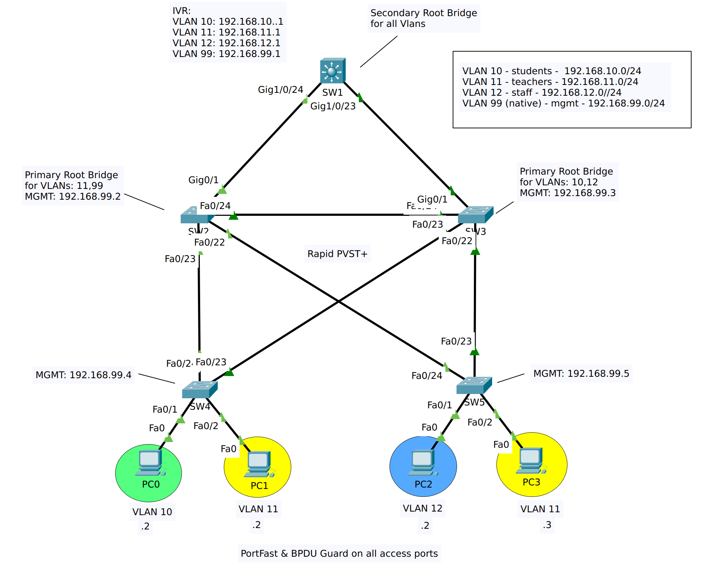

# CCNA Lab - Inter-vlan routing y Spanning Tree Protocol

En el siguiente laboratorio se muestra el funcionamiento del protocolo Rapid Spanning Tree Protocol (Rapid PVST+) de CISCO. en una red multi vlan, formada por varios switches tanto L2 como L2/L3

## Objetivo

El proposito de este laboratorio es configurar una red con 3 VLANs de trafico de usuario, así como una VLAN para la administración de los equipos de red, la red se configurará para utilizar la VLAN 99 como Vlan nativa y el enrutamiento inter-vlan lo realizará el SW1 por medio de SVIs.

Se deben configurar los puertos de acceso y troncales en cada switch, los enlaces troncales solo deben permitir el trafico de las vlans utilizadas en la red, y la vlan nativa sera la 99.

El protocolo STP a utilizar es Rapid PVST+, y se debe configurar el SW3 como root bridge prinicipal para las Vlans 10 y 12, el SW2 como el bridge root principal para las Vlans 11 y 99, el SW1 debe ser el root bridge secundario para todas las Vlans.

## Topología 



Descargar archivo de [packet tracer](labs/ccna-lab-intervlan-stp.start.pkt).

## Procedimiento

### Parte 1: Definicion de VLANS

Agregamos las VLANs en todos los switches de la red,  aqui se muestra un ejemplo para SW1, sin embargo esto mismo se debe configurar en todos los switches.


```text
SW1(config)#
SW1(config)#vlan 10
SW1(config-vlan)#name students
SW1(config-vlan)#vlan 11
SW1(config-vlan)#name teachers
SW1(config-vlan)#vlan 12
SW1(config-vlan)#name staff
SW1(config-vlan)#vlan 99
SW1(config-vlan)#name mgmt
SW1(config-vlan)#exit
SW1(config)#
```

### Parte 2: Puertos de acceso

Configuración de los puertos de acceso en SW4:

```text
SW4(config)#
SW4(config)#interface f0/1
SW4(config-if)#switchport mode access
SW4(config-if)#switchport access vlan 10
SW4(config-if)#exit
SW4(config)#interface f0/2
SW4(config-if)#switchport mode access
SW4(config-if)#switchport access vlan 11
SW4(config-if)#exit
SW4(config)#
```

Configuración de los puertos de acceso en SW5:

```
SW5(config)#
SW5(config)#interface fa0/1
SW5(config-if)#switchport mode access
SW5(config-if)#switchport access vlan 12
SW5(config-if)#exit
SW5(config)#
SW5(config)#interface fa0/2
SW5(config-if)#switchport mode access
SW5(config-if)#switchport access vlan 11
SW5(config-if)#exit
SW5(config)#
```

### Parte 3: Configuración de enlaces troncales

Configuramos los enlaces troncales entre switcehs, unicamente permitimos las VLANS utilizadas en la red, y configuramos la VLAN nativa.


```
SW4(config)#
SW4(config)#int
SW4(config)#interface range fa0/23-24
SW4(config-if-range)#switchport mode trunk
SW4(config-if-range)#switchport trunk allowed vlan 10,11,12,99
SW4(config-if-range)#switchport trunk native vlan 99
SW4(config-if-range)#

```

```
SW5(config)#
SW5(config)#interface range f0/23-24
SW5(config-if-range)#switchport mode trunk
SW5(config-if-range)#switchport trunk allowed vlan 10,11,12,99
SW5(config-if-range)#switchport trunk native vlan 99
SW5(config-if-range)#
SW5(config-if-range)#exit
SW5(config)#
```


```
SW2(config)#
SW2(config)#interface range fa0/22-24,G0/1
SW2(config-if-range)#switchport mode trunk
SW2(config-if-range)#switchport trunk allowed vlan 10,11,12,99
SW2(config-if-range)#switchport trunk native vlan 99
SW2(config-if-range)#exit
SW2(config)#
```


```
SW3(config)#
SW3(config)#interface range Fa0/22-24,g0/1
SW3(config-if-range)#switchport mode trunk
SW3(config-if-range)#switchport trunk allowed vlan 10,11,12,99
SW3(config-if-range)#switchport trunk native vlan 99
SW3(config-if-range)#exit
SW3(config)#
```


```
SW1(config)#
SW1(config)#interface range Gi1/0/23-24
SW1(config-if-range)#switchport mode trunk
SW1(config-if-range)#switchport trunk allowed vlan 10,11,12,99
SW1(config-if-range)#switchport trunk native vlan 99
SW1(config-if-range)#
SW1(config-if-range)#exit
```

> Mientras realizamos la configuración de los enlaces troncales en todos los switches, nos iran apareciendo los siguiente mensajes de advertencia. Estos los podemos ignorar y deben desaparecer una vez todos los switches tengan la misma configuración.

```
4-NATIVE_VLAN_MISMATCH: Native VLAN mismatch discovered on FastEthernet0/24 (99), with SW2 FastEthernet0/23 (1).
%SPANTREE-2-RECV_PVID_ERR: Received BPDU with inconsistent peer vlan id 1 on FastEthernet0/23 VLAN99.
%SPANTREE-2-BLOCK_PVID_LOCAL: Blocking FastEthernet0/23 on VLAN0099. Inconsistent local vlan.
%SPANTREE-2-RECV_PVID_ERR: Received BPDU with inconsistent peer vlan id 1 on FastEthernet0/24 VLAN99.
%SPANTREE-2-BLOCK_PVID_LOCAL: Blocking FastEthernet0/24 on VLAN0099. Inconsistent local vlan.
```

Ahora verificamos el estado de los enlaces troncales luego de haber realizado la configuración en todos los switches:

```
SW4#show interface trunk
Port        Mode         Encapsulation  Status        Native vlan
Fa0/23      on           802.1q         trunking      99
Fa0/24      on           802.1q         trunking      99

Port        Vlans allowed on trunk
Fa0/23      10-12,99
Fa0/24      10-12,99

Port        Vlans allowed and active in management domain
Fa0/23      10,11,12,99
Fa0/24      10,11,12,99

Port        Vlans in spanning tree forwarding state and not pruned
Fa0/23      10,11,12,99
Fa0/24      none

```

```
SW5#show interface trunk
Port        Mode         Encapsulation  Status        Native vlan
Fa0/23      on           802.1q         trunking      99
Fa0/24      on           802.1q         trunking      99

Port        Vlans allowed on trunk
Fa0/23      10-12,99
Fa0/24      10-12,99

Port        Vlans allowed and active in management domain
Fa0/23      10,11,12,99
Fa0/24      10,11,12,99

Port        Vlans in spanning tree forwarding state and not pruned
Fa0/23      10,11,12,99
Fa0/24      none

```

```
SW2#show interface trunk
Port        Mode         Encapsulation  Status        Native vlan
Fa0/22      on           802.1q         trunking      99
Fa0/23      on           802.1q         trunking      99
Fa0/24      on           802.1q         trunking      99
Gig0/1      on           802.1q         trunking      99

Port        Vlans allowed on trunk
Fa0/22      10-12,99
Fa0/23      10-12,99
Fa0/24      10-12,99
Gig0/1      10-12,99

Port        Vlans allowed and active in management domain
Fa0/22      10,11,12,99
Fa0/23      10,11,12,99
Fa0/24      10,11,12,99
Gig0/1      10,11,12,99

Port        Vlans in spanning tree forwarding state and not pruned
Fa0/22      10,11,12,99
Fa0/23      10,11,12,99
Fa0/24      none
Gig0/1      10,11,12,99

```

```
SW3#show interface trunk
Port        Mode         Encapsulation  Status        Native vlan
Fa0/22      on           802.1q         trunking      99
Fa0/23      on           802.1q         trunking      99
Fa0/24      on           802.1q         trunking      99
Gig0/1      on           802.1q         trunking      99

Port        Vlans allowed on trunk
Fa0/22      10-12,99
Fa0/23      10-12,99
Fa0/24      10-12,99
Gig0/1      10-12,99

Port        Vlans allowed and active in management domain
Fa0/22      10,11,12,99
Fa0/23      10,11,12,99
Fa0/24      10,11,12,99
Gig0/1      10,11,12,99

Port        Vlans in spanning tree forwarding state and not pruned
Fa0/22      10,11,12,99
Fa0/23      10,11,12,99
Fa0/24      10,11,12,99
Gig0/1      10,11,12,99

```

```
SW1#show interface trunk
Port        Mode         Encapsulation  Status        Native vlan
Gig1/0/23   on           802.1q         trunking      99
Gig1/0/24   on           802.1q         trunking      99

Port        Vlans allowed on trunk
Gig1/0/23   10-12,99
Gig1/0/24   10-12,99

Port        Vlans allowed and active in management domain
Gig1/0/23   10,11,12,99
Gig1/0/24   10,11,12,99

Port        Vlans in spanning tree forwarding state and not pruned
Gig1/0/23   10,11,12,99
Gig1/0/24   10,11,12,99

```

### Parte 3: Administración de switches (opcional)

Ahora vamos a configurar las interfaces SVI para la administración de los switches, el default gateway, y las credenciales de acceso.


```
SW2(config)#
SW2(config)#interface vlan 99
SW2(config-if)#ip address 192.168.99.2 255.255.255.0
SW2(config-if)#exit
SW2(config)#ip default-gateway 192.168.99.1
SW2(config)#enable secret class
SW2(config)#line vty 0 15
SW2(config-line)#password cisco
SW2(config-line)#login
SW2(config-line)#exit
SW2(config)#service password-encryption 
```

```
SW3(config)#
SW3(config)#interface vlan 99
SW3(config-if)#ip address 192.168.99.3 255.255.255.0
SW3(config-if)#exit
SW3(config)#ip default-gateway 192.168.99.1
SW3(config)#enable secret class
SW3(config)#line vty 0 15
SW3(config-line)#password cisco
SW3(config-line)#login
SW3(config-line)#exit
SW3(config)#service password-encryption 
```

```
SW4(config)#
SW4(config)#interface vlan 99
SW4(config-if)#ip address 192.168.99.4 255.255.255.0
SW4(config-if)#exit
SW4(config)#ip default-gateway 192.168.99.1
SW4(config)#enable secret class
SW4(config)#line vty 0 15
SW4(config-line)#password cisco
SW4(config-line)#login
SW4(config-line)#exit
SW4(config)#service password-encryption 
```

```
SW5(config)#
SW5(config)#interface vlan 99
SW5(config-if)#ip address 192.168.99.5 255.255.255.0
SW5(config-if)#exit
SW5(config)#ip default-gateway 192.168.99.1
SW5(config)#enable secret class
SW5(config)#line vty 0 15
SW5(config-line)#password cisco
SW5(config-line)#login
SW5(config-line)#exit
SW5(config)#service password-encryption 
```

Para el SW1 no es necesario crear otra SVI para la Vlan 99, ya que se utilizará la misma para el enrutamiento inter-vlan.

```
SW1(config)#
SW1(config)#enable secret class
SW1(config)#line vty 0 15
SW1(config-line)#password cisco
SW1(config-line)#login
SW2(config-line)#exit
SW1(config)#service password-encryption 
```


### Parte 5: Inter Vlan Routing

Habilitamos el proceso de routing, y configuramos las SVI's (una por VLAN) en SW1, para que haga el enrutamiento intervlan. 

```
SW1(config)#
SW1(config)#ip routing
SW1(config)#interface vlan 10
SW1(config-if)#ip address 192.168.10.1 255.255.255.0
SW1(config-if)#exit
SW1(config)#interface vlan 11
SW1(config-if)#ip address 192.168.11.1 255.255.255.0
SW1(config-if)#exit
SW1(config)#interface vlan 12
SW1(config-if)#ip address 192.168.12.1 255.255.255.0
SW1(config-if)#exit
SW1(config)#interface vlan 99
SW1(config-if)#ip address 192.168.99.1 255.255.255.0
SW1(config-if)#exit
SW1(config)#
```

### Parte 6: Modificación del Spanning Tree

Primero cambiamos la version del protocolo a **rapid pvst+** en toda la red, solo se muestra el SW1 pero esto mismo se debe repetir en el resto de switches

```
SW1(config)#spanning-tree mode rapid-pvst

```

Aqui podemos ver que SW3 es el root bridge para todas las VLANs en la topología:

```
SW3#show spanning-tree summary 
Switch is in rapid-pvst mode
Root bridge for: default students teachers staff mgmt
```

Vamos a modificar el arbol STP asignando root bridges diferentes por vlan, según lo indicado en las instrucciones:


SW3 será el root principal para las vlan 10 y 12:
```
SW3(config)#
SW3(config)#spanning-tree vlan 10 root primary 
SW3(config)#spanning-tree vlan 12 root primary 
SW3(config)#
```

SW2 será el root principal para las vlans 11 y 99

```
SW2(config)#
SW2(config)#spanning-tree vlan 11 root primary 
SW2(config)#spanning-tree vlan 99 root primary 
SW2(config)#
```

SW1 será el root secundario, para todas las Vlans.

```
SW1(config)#
SW1(config)#spanning-tree vlan 10 root secondary 
SW1(config)#spanning-tree vlan 11 root secondary 
SW1(config)#spanning-tree vlan 12 root secondary 
SW1(config)#spanning-tree vlan 99 root secondary 
SW1(config)#
```


Aqui podemos ver que SW3 es ahora root brige para las vlans default, `student` y `staff`:


```
SW3#show spanning-tree summary 
Switch is in rapid-pvst mode
Root bridge for: default students staff
```

Y SW2 es root bridge para las vlan `teachers` y `mgmt`:

```
SW2#show spanning-tree summary 
Switch is in rapid-pvst mode
Root bridge for: teachers mgmt
```

### Parte 7: Features adicionales de STP (PortFast y BPDUGuard)

Ahora vamos a configurar las funcionalidades de `PortFast` y `BPDUGuard` en los puertos de acceso (que conectan hosts). 

Aqui Se muestra el ejemplo para SW4, el mismo procedimiento se debe seguir en SW5

*Observe que aparece un mensaje de advertencia al configurar portfast, este caso se puede ignorar.*

```
SW4(config)#interface r
SW4(config)#interface range f0/1-2
SW4(config-if-range)#spanning-tree portfast 
%Warning: portfast should only be enabled on ports connected to a single
host. Connecting hubs, concentrators, switches, bridges, etc... to this
interface  when portfast is enabled, can cause temporary bridging loops.
Use with CAUTION

%Portfast has been configured on FastEthernet0/1 but will only
have effect when the interface is in a non-trunking mode.
%Warning: portfast should only be enabled on ports connected to a single
host. Connecting hubs, concentrators, switches, bridges, etc... to this
interface  when portfast is enabled, can cause temporary bridging loops.
Use with CAUTION

%Portfast has been configured on FastEthernet0/2 but will only
have effect when the interface is in a non-trunking mode.
SW4(config-if-range)#
SW4(config-if-range)#spanning-tree bpduguard enable 
SW4(config-if-range)#exit
SW4(config)#

```

## Conclusiones

Con este laboratorio hemos practicado con el protocolo spanning tree, especificamente la version **rapid pvst+,** de CISCO, y hemos modificado el arbol de spanning tree para poder balancear el trafico entre las diferentes vlans de la red.

Este laboratorio es el **primero** de una serie de **3**, los laboratorios posteriores los puede encontrar aqui, [Parte 2](CCNA%20lab%20Etherchannel.md), y [Parte 3](CCNA%20lab%20DHCPv4.md).

    
    


