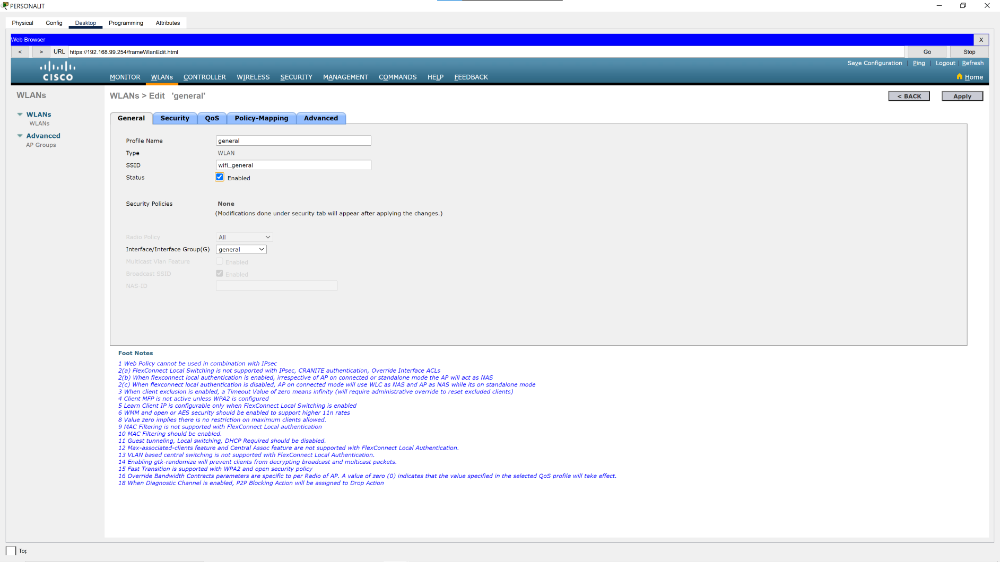
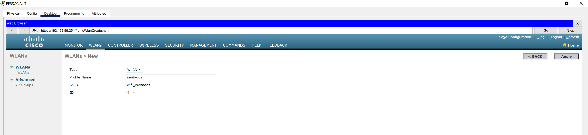
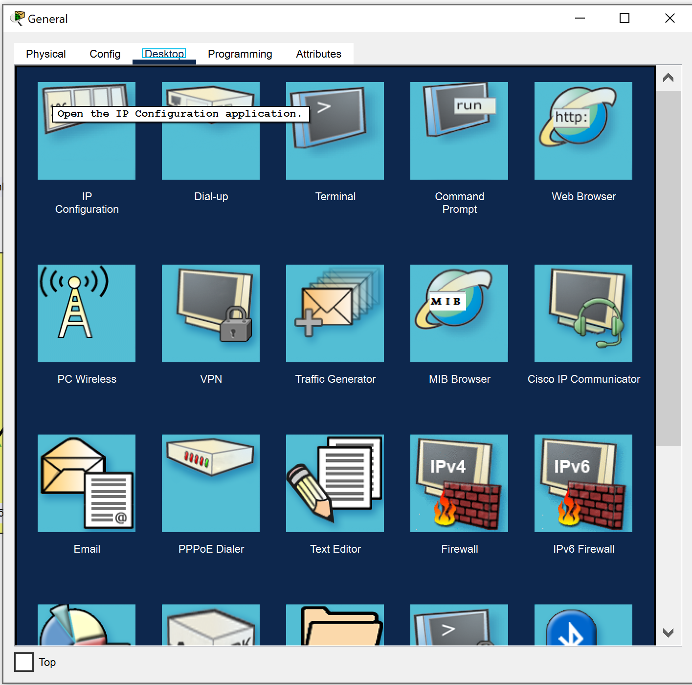
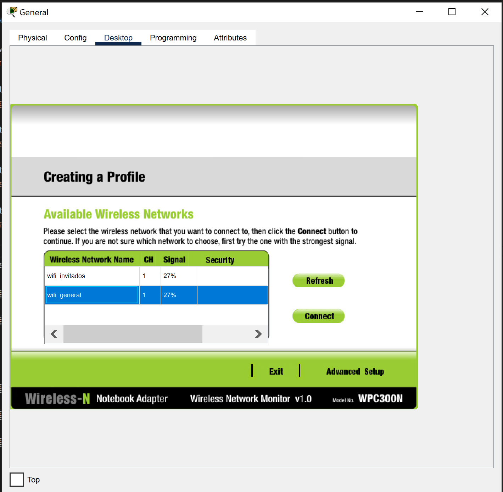

# Laboratorio CCNA: WLAN+DHCP+RADIUS


## Archivo PT:

[Configuración final](labs/labCCNA%20WLAN+DHCP+RADIUS.pkt)

## Instrucciones:
- VLANS y subnets:
  - Datos -  VLAN 2 - 192.168.2.0/24
  - Wifi_general - VLAN 3 -192.168.3.0/24
  - Wifi_invitados - VLAN 4 - 192.168.4.0/24
  - Servidores - VLAN 99 - 192.168.4.0/24

- Utilizar VLAN 99 para management y como vlan nativa
- Inter-vlan routing:
  - Aplicar Routing-on-stick
  - Como default gateway dejar la primera IP de cada subnet
- Servidor DHCP
  - Utilizar un Router como servidor DHCP
  - Entregar direcciones desde la 100 hasta la 119, para cada subnet
- Wireless LAN Contoller
  - Crear una Wifi general y una Wifi Invitados y asignar segun la VLAN correspondiente
- Servidor Radius
  - secret: Cisco123
  - Crear 2 usuarios:
    - user1 / 12345
    - user2 / 12345

## Procedimiento Paso a Paso:
### 1. Definición de VLANS

```
DIST(config)#vlan 2
DIST(config-vlan)#name Datos
DIST(config-vlan)#vlan 3
DIST(config-vlan)#name Wifi_general
DIST(config-vlan)#vlan 4
DIST(config-vlan)#name Wifi_invitados
DIST(config-vlan)#vlan 99
DIST(config-vlan)#name Servidores
DIST(config-vlan)#exit
DIST(config)#
```
### 2. Puertos troncales

```
DIST(config)#interface range Gi0/1-2,Fa0/3
DIST(config-if-range)#switchport mode trunk
DIST(config-if-range)#switchport trunk allowed vlan 2,3,4,99
DIST(config-if-range)#switchport trunk native vlan 99
DIST(config-if-range)#exit
```

```
LAN(config)#
LAN(config)#interface range gi0/1,f0/24
LAN(config-if-range)#switchport mode trunk
LAN(config-if-range)#switchport trunk allowed vlan 2,3,4,99
LAN(config-if-range)#switchport trunk native vlan 99
LAN(config-if-range)#exit
```

```
DATACENTER(config)#interface range gi0/2,f0/24
DATACENTER(config-if-range)#switchport mode trunk
DATACENTER(config-if-range)#switchport trunk allowed vlan 2,3,4,99
DATACENTER(config-if-range)#exit
```
### 3. Puertos de acceso

```
LAN(config)#interface fa0/1
LAN(config-if)#switchport mode access 
LAN(config-if)#switchport acces vlan 2
LAN(config-if)#exit
LAN(config)#
```

```
DATACENTER(config)#interface range f0/21-23
DATACENTER(config-if-range)#switchport mode access
DATACENTER(config-if-range)#switchport access vlan 99
DATACENTER(config-if-range)#exit
```
### 4. Enrutamiento inter-vlan (incluido el DHCP relay)
```
IVR(config)#interface gi0/0/0.2
IVR(config-subif)#encapsulation dot1q 2
IVR(config-subif)#ip address 192.168.2.1 255.255.255.0
IVR(config-subif)#ip helper-address 192.168.99.253
IVR(config-subif)#exit
IVR(config)#

IVR(config)#interface gi0/0/0.3
IVR(config-subif)#encapsulation dot1q 3
IVR(config-subif)#ip address 192.168.3.1 255.255.255.0
IVR(config-subif)#ip helper-address 192.168.99.253
IVR(config-subif)#exit
IVR(config)#

IVR(config)#interface gi0/0/0.4
IVR(config-subif)#encapsulation dot1q 4
IVR(config-subif)#ip address 192.168.4.1 255.255.255.0
IVR(config-subif)#ip helper-address 192.168.99.253
IVR(config-subif)#exit
IVR(config)#

IVR(config)#interface gi0/0/0.99
IVR(config-subif)#encapsulation dot1q 99 native
IVR(config-subif)#ip address 192.168.99.1 255.255.255.0
IVR(config-subif)#exit
IVR(config)#

IVR(config)#interface gi0/0/0
IVR(config-if)#no shutdown
IVR(config-if)#exit
IVR(config-if)#
```

### 5. DHCP Server

```
DHCP(config)#interface gi0/0/0
DHCP(config-if)#ip address 192.168.99.253 255.255.255.0
DHCP(config-if)#no shutdown
DHCP(config-if)#exit
DHCP(config)#ip route 0.0.0.0 0.0.0.0 192.168.99.1
DHCP(config)#ip dhcp excluded-address 192.168.2.1 192.168.2.99
DHCP(config)#ip dhcp excluded-address 192.168.2.120 192.168.2.254
DHCP(config)#ip dhcp excluded-address 192.168.3.1 192.168.3.99
DHCP(config)#ip dhcp excluded-address 192.168.3.120 192.168.3.254
DHCP(config)#ip dhcp excluded-address 192.168.4.1 192.168.4.99
DHCP(config)#ip dhcp excluded-address 192.168.4.120 192.168.4.254
DHCP(config)#ip dhcp excluded-address 192.168.99.1 192.168.99.99
DHCP(config)#ip dhcp excluded-address 192.168.99.120 192.168.99.254
DHCP(config)#ip dhcp pool datos
DHCP(dhcp-config)#network 192.168.2.0 255.255.255.0
DHCP(dhcp-config)#default-router 192.168.2.1
DHCP(dhcp-config)#dns-server 8.8.8.8
DHCP(dhcp-config)#ip dhcp pool wifi_general
DHCP(dhcp-config)#network 192.168.3.0 255.255.255.0
DHCP(dhcp-config)#default-router 192.168.3.1
DHCP(dhcp-config)#dns-server 8.8.8.8
DHCP(dhcp-config)#ip dhcp pool wifi_invitados
DHCP(dhcp-config)#network 192.168.4.0 255.255.255.0
DHCP(dhcp-config)#default-router 192.168.4.1
DHCP(dhcp-config)#dns-server 8.8.8.8
DHCP(dhcp-config)#ip dhcp pool servidores
DHCP(dhcp-config)#network 192.168.99.0 255.255.255.0
DHCP(dhcp-config)#default-router 192.168.99.1
DHCP(dhcp-config)#dns-server 8.8.8.8
DHCP(dhcp-config)#
```

### 6. Configuración de WLC y redes Wifi
   
#### 6.1 Interfaces  

Controller > Interfaces


**Interfaz para wlan "general" - Vlan 3**
Controller > Interfacez > general
  

**Interfaz para wlan "invitados" - Vlan 4**
Controller > Interfacez > invitados


#### 6.2 Configuración de Servidor Radius (AAA) en la WLC


#### 6.3 Configuración de las redes WLAN

WLANs


**WLAN General**

WLANs > Create New > Go


WLANs > wifi_general > General


WLANs > wifi_general > Security > Layer 2


WLANs > wifi_general > Security > AAA


WLANs > wifi_general > Advanced
  


**Wlan Invitados**

WLANs > Create New > Go


WLANs > wifi_invitados > General


WLANs > wifi_invitados > Security > Layer 2


WLANs > wifi_invitados > Security > AAA


WLANs > wifi_invitados > Advanced


### 7. Servidor Radius


  


### 8. Clientes Wifi

  

  

  

  

  

  

  

  

  

  
