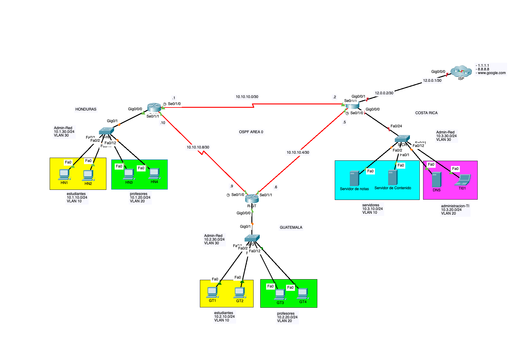

# 1. Laboratorio CCNA3 - Router-on-stick + OSPF + ACLs

## 1.1. Objetivo

El propósito de este laboratorio es poner en práctica los conocimientos aprendidos sobre enrutamiento inter-VLAN mediante Router-on-stick, OSPF de una sola área y Listas de Control de Acceso (ACLs) en una red cuya topología representa una situación real.

## 1.2. Descripción del Escenario

En el siguiente escenario se presenta el diagrama de red de una institución educativa con operaciones en tres países: Guatemala, Honduras y Costa Rica. Cada uno de estos países cuenta con un router que conecta las redes locales a través de enlaces WAN y utilizan OSPF para el enrutamiento entre las distintas localidades.

Tanto en Guatemala como en Honduras, existen dos VLANs: una para estudiantes y otra para profesores. En Costa Rica se encuentran los servidores centrales de la institución y el personal de administración, así como la salida a internet para toda la red.

## 1.3. Diagrama de Red

  

## 1.4. Archivo inicial de Packet Tracer

Este es el laboratorio con la [configuración inicial](labs/lab2jul_init.pkt)

## 1.5. Detalle de direccionamiento IP y asignación de VLANs

### 1.5.1. Tabla de VLANs y Subredes Asignadas

| País       | VLAN           | Red           | Descripción                  | Rango de Puertos  |
|------------|----------------|---------------|------------------------------|-------------------|
| Guatemala  | VLAN 10        | 10.2.10.0/24  | Estudiantes                  | Fa0/1 - Fa0/10    |
| Guatemala  | VLAN 20        | 10.2.20.0/24  | Profesores                   | Fa0/11 - Fa0/20   |
| Guatemala  | VLAN 30        | 10.2.30.0/24  | Admin-Red                    | N/A               |
| Honduras   | VLAN 10        | 10.1.10.0/24  | Estudiantes                  | Fa0/1 - Fa0/10    |
| Honduras   | VLAN 20        | 10.1.20.0/24  | Profesores                   | Fa0/11 - Fa0/20   |
| Honduras   | VLAN 30        | 10.1.30.0/24  | Admin-Red                    | N/A               |
| Costa Rica | VLAN 10        | 10.3.10.0/24  | Servidores                   | Fa0/1 - Fa0/10    |
| Costa Rica | VLAN 20        | 10.3.20.0/24  | Administración               | Fa0/11 - Fa0/20   |
| Costa Rica | VLAN 30        | 10.3.30.0/24  | Admin-Red                    | N/A               |
| Guatemala a Honduras | N/A  | 10.10.10.0/30 | Enlace punto a punto         | N/A               |
| Guatemala a Costa Rica | N/A| 10.10.10.4/30 | Enlace punto a punto         | N/A               |
| Honduras a Costa Rica | N/A | 10.10.10.8/30 | Enlace punto a punto         | N/A               |

### 1.5.2. Tabla de Asignación de IPs

| Dispositivo      | Interfaz         | IP Address         |
|------------------|------------------|--------------------|
| R-HN             | Gig0/0.10        | 10.1.10.1/24       |
| R-HN             | Gig0/0.20        | 10.1.20.1/24       |
| R-HN             | Gig0/0.30        | 10.1.30.1/24       |
| R-HN             | Se0/1/0          | 10.10.10.1/30      |
| R-HN             | Se0/1/1          | 10.10.10.10/30     |
| R-HN             | Lo0              | 10.1.1.1/32        |
| R-GT             | Gig0/0.10        | 10.2.10.1/24       |
| R-GT             | Gig0/0.20        | 10.2.20.1/24       |
| R-GT             | Gig0/0.30        | 10.2.30.1/24       |
| R-GT             | Se0/1/0          | 10.10.10.9/30      |
| R-GT             | Se0/1/1          | 10.10.10.6/30      |
| R-GT             | Lo0              | 10.1.1.2/32        |
| R-CR             | Gig0/0.10        | 10.3.10.1/24       |
| R-CR             | Gig0/0.20        | 10.3.20.1/24       |
| R-CR             | Gig0/0.30        | 10.3.30.1/24       |
| R-CR             | Se0/1/0          | 10.10.10.5/30      |
| R-CR             | Se0/1/1          | 10.10.10.2/30      |
| R-CR             | Gig0/0/1         | 12.0.0.2/30        |
| R-CR             | Lo0              | 10.1.1.3/32        |
| S-HN             | VLAN 30 SVI      | 10.1.30.2/24       |
| S-GT             | VLAN 30 SVI      | 10.2.30.2/24       |
| S-CR             | VLAN 30 SVI      | 10.3.30.2/24       |
| HN1              | Fa0              | 10.1.10.2/24       |
| HN2              | Fa0              | 10.1.10.3/24       |
| HN3              | Fa0              | 10.1.20.2/24       |
| HN4              | Fa0              | 10.1.20.3/24       |
| GT1              | Fa0              | 10.2.10.2/24       |
| GT2              | Fa0              | 10.2.10.3/24       |
| GT3              | Fa0              | 10.2.20.2/24       |
| GT4              | Fa0              | 10.2.20.3/24       |
| Servidor de Notas| Fa0              | 10.3.10.2/24       |
| Servidor de Contenido| Fa0          | 10.3.10.3/24       |
| TI01             | Fa0              | 10.3.20.2/24       |
| DNS              | Fa0              | 10.3.20.3/24       |

## 1.6. Instrucciones

### 1.6.1. Sección 1: Parámetros iniciales
- En todos los dispositivos, configure el nombre de host.
- Configure un mensaje del día (MOTD) que contenga la palabra `advertencia`.
- Proteja el acceso a consola con el password `cisco`.
- Proteja el acceso a modo EXEC privilegiado con el password `class`.
- Encripte las contraseñas en el archivo de configuración.

### 1.6.2. Sección 2: Acceso por SSH 
- Configure un nombre de dominio `mylab.com`.
- Genere un par de llaves RSA con **1024 bits** para habilitar SSH.
- Cree un usuario `admin` con contraseña segura `letmein` y el **máximo** privilegio.
- Habilite el acceso por SSH en todas las terminales virtuales disponibles, asegúrese de utilizar la base de datos local para la autenticación de usuarios.
- Asegúrese de estar utilizando la versión 2 del protocolo SSH.

### 1.6.3. Sección 3: Configuración de Enlaces WAN
- Configure las interfaces de los enlaces WAN en los routers de GT, HN y CR de acuerdo a la [Tabla de Asignación de IPs](#tabla-de-asignación-de-ips).
- Agregue una descripción en las interfaces.

### 1.6.4. Sección 4: VLANs y Puertos de Switch
- Configure las VLANs en S-HN, S-GT y S-CR de acuerdo a la información proporcionada en la [Tabla de VLANs y Subredes Asignadas](#tabla-de-vlans-y-subredes-asignadas).
- Configure los puertos de acceso en S-HN y S-GT según la información proporcionada en la [Tabla de VLANs y Subredes Asignadas](#tabla-de-vlans-y-subredes-asignadas).
- Configure los enlaces troncales en S-HN, S-GT y S-CR de forma estática, de acuerdo con la [Tabla de VLANs y Subredes Asignadas](#tabla-de-vlans-y-subredes-asignadas). ***Únicamente debe permitir el tráfico de las VLANs utilizadas en el ejercicio y rechazar cualquier tráfico que pertenezca a otra VLAN.***
- Habilite las interfaces de administración en S-HN, S-GT y S-CR y asigne las direcciones IP, de acuerdo con la información proporcionada en la [Tabla de Asignación de IPs](#tabla-de-asignación-de-ips).
- Configure lo necesario para que el switch pueda ser alcanzado desde redes externas.

### 1.6.5. Sección 5: Enrutamiento Inter-VLAN
- Habilite el enrutamiento inter-VLAN en los routers R-HN, R-GT y R-CR mediante la configuración de las subinterfaces correspondientes, según lo indicado en la [Tabla de Asignación de IPs](#tabla-de-asignación-de-ips). No olvide habilitar el enrutamiento IPv4 en los routers.

### 1.6.6. Sección 6: Direcciones de los Hosts
- Asigne las direcciones IP a las PCs de acuerdo a la información proporcionada en la [Tabla de Asignación de IPs](#tabla-de-asignación-de-ips).
- Asigne como DNS la IP del servidor DNS indicado.

### 1.6.7. Sección 7: Configuración de OSPF
- Configure OSPF de una sola área en los routers de HN, GT y CR para anunciar todas las redes.
- Utilice el ID de Proceso No. 1.
- Confirme que el router ID asignado sea la IP en la interfaz de loopback.
- Configure las interfaces pasivas para evitar anunciar paquetes OSPF por las interfaces hacia las LAN.

### 1.6.8. Sección 8: Configuración de Salida a Internet
- Configure la interfaz conectada hacia el ISP con la IP pública asignada.
- Configure una ruta por defecto en R-CR para enviar el tráfico con destino a internet hacia la IP del ISP (12.0.0.1).
- Redistribuya esta ruta por defecto por medio del protocolo OSPF en la única área configurada.

### 1.6.9. Sección 9: Verificación de Conectividad
- Verifique la conectividad entre los dispositivos en diferentes VLANs y localizaciones.
- Verifique que los hosts de GT y HN obtengan respuesta de las IPs de internet 1.1.1.1 y 8.8.8.8.
- Verifique que los hosts de GT y HN puedan acceder por medio del explorador a www.google.com.
- Pruebe el acceso por SSH a los dispositivos de red.

### 1.6.10. Sección 10: Políticas de Seguridad mediante ACLs
- Ahora que ha probado la conectividad en toda la red, implemente las siguientes políticas de seguridad mediante la configuración de Listas de Control de Acceso en los Routers GT, HN y CR:
  1. No permitir que las redes de estudiantes tengan conectividad con los profesores.
  2. Los profesores pueden acceder al Servidor de Notas solo por FTP.
  3. Los estudiantes pueden acceder al Servidor de Notas solo por HTTP y HTTPS.
  4. Solo los profesores pueden acceder al Servidor de Contenido y solo por HTTP y HTTPS.
  5. No permitir que los profesores ni los estudiantes tengan conectividad con la red de Administración-TI.
  6. Solo los profesores pueden salir a internet.
  7. Solo la PC TI01 puede acceder por SSH a los dispositivos de red.


## 1.7. Resolución Paso a Paso

### 1.7.1. Sección 1: Parametros iniciales

```shell
hostname R-HN
banner motd "advertencia: acceso restringido"
line console 0
password cisco
login
exit
enable secret class
service password-encryption 
```
> Repetir en todos los dispositivos de red, unicamente modificando el `hostname`

### 1.7.2. Sección 2: Acceso por SSH

```
ip domain-name mylab.com
crypto key generate rsa
1024
username admin secret letmein
username admin privilege 15
line vty 0 15
login local
transport input ssh
exit
ip ssh version 2
no ip domain-lookup
```

> Repetir en todos los dispositivos de red

### 1.7.3. Sección 3: Configuración de Enlaces WAN

#### 1.7.3.1. R-HN (HONDURAS)
```
interface S0/1/0
description enlace Honduras-Costa Rica
ip address 10.10.10.1 255.255.255.252
no shutdown
interface S0/1/1
description enlace Honduras-Guatemala
ip address 10.10.10.10 255.255.255.252
no shutdown
exit
```

#### 1.7.3.2. R-GT (GUATEMALA)
```
interface S0/1/0
description enlace Honduras-Guatemala
ip address 10.10.10.9 255.255.255.252
no shutdown
interface S0/1/1
description enlace Guatemala-CostaRica
ip address 10.10.10.6 255.255.255.252
no shutdown
exit
```

#### 1.7.3.3. R-CR (Costa Rica)
```
interface S0/1/0
description enlace Guatemala-CostaRica
ip address 10.10.10.5 255.255.255.252
no shutdown
interface S0/1/1
description enlace Honduras-Costa Rica
ip address 10.10.10.2 255.255.255.252
no shutdown
exit
```

### 1.7.4. Sección 4: VLANs y Puertos de Switch

##### 1.7.4.0.1. 4.1 Declarar las VLANs en el Switch
```
vlan 10
name estudiantes
vlan 20
name profesores
vlan 30
name Admin-Red
exit
```
> Repetir en todos los switches

#### 1.7.4.1. 4.2 Asignacion de puertos de acceso
```
interface range f0/1-10
switchport mode access
switchport access vlan 10
exit
interface range f0/11-20
switchport mode access
switchport access vlan 20
exit
```

> Repetir en todos los switches

#### 1.7.4.2. 4.3 Configuracion de puerto troncal en el switch
```
interface g0/1
switchport mode trunk 
switchport trunk allowed vlan 10,20,30
switchport trunk native vlan 99
switchport nonegotiate 
exit
```

> Repetir en todos los switches

#### 1.7.4.3. 4.4 Configuracion de SVI para administracion del switch

##### 1.7.4.3.1. S-HN
```
interface vlan 30
ip address 10.1.30.2 255.255.255.0
exit
ip default-gateway 10.1.30.1
```

##### 1.7.4.3.2. S-GT
```
interface vlan 30
ip address 10.2.30.2 255.255.255.0
exit
ip default-gateway 10.2.30.1
```

### 1.7.5. Sección 5: Enrutamiento Inter-VLAN

##### 1.7.5.0.1. R-HN
```
interface g0/0/0.10
description estudiantes-honduras
encapsulation dot1Q 10
ip address 10.1.10.1 255.255.255.0
exit

interface g0/0/0.20
description profesores-honduras
encapsulation dot1Q 20
ip address 10.1.20.1 255.255.255.0
exit

interface g0/0/0.30
description adminred-honduras
encapsulation dot1Q 30
ip address 10.1.30.1 255.255.255.0
exit

interface g0/0/0.99
description native-honduras
encapsulation dot1Q 99 native
exit    

interface g0/0/0
no shutdown
```

##### 1.7.5.0.2. R-GT
```
interface g0/0/0.10
description estudiantes-guatemala
encapsulation dot1Q 10
ip address 10.2.10.1 255.255.255.0
exit

interface g0/0/0.20
description profesores-guatemala
encapsulation dot1Q 20
ip address 10.2.20.1 255.255.255.0
exit

interface g0/0/0.30
description adminred-guatemala
encapsulation dot1Q 30
ip address 10.2.30.1 255.255.255.0
exit

interface g0/0/0.99
description native-guatemala
encapsulation dot1Q 99 native
exit    

interface g0/0/0
no shutdown
```

#### 1.7.5.1. Sección 7: Configuración de OSPF

##### 1.7.5.1.1. R-HN
```
interface lo0
ip address 10.1.1.1 255.255.255.255
exit
router ospf 1
network 10.10.10.0 0.0.0.3 area 0
network 10.10.10.8 0.0.0.3 area 0
network 10.1.10.0 0.0.0.255 area 0
network 10.1.20.0 0.0.0.255 area 0
network 10.1.30.0 0.0.0.255 area 0
passive-interface g0/0/0.10
passive-interface g0/0/0.20
passive-interface g0/0/0.30
exit
```
##### 1.7.5.1.2. R-GT
```
interface lo0
ip address 10.1.1.2 255.255.255.255
exit
router ospf 1
network 10.10.10.4 0.0.0.3 area 0
network 10.10.10.8 0.0.0.3 area 0
network 10.2.10.0 0.0.0.255 area 0
network 10.2.20.0 0.0.0.255 area 0
network 10.2.30.0 0.0.0.255 area 0
passive-interface g0/0/0.10
passive-interface g0/0/0.20
passive-interface g0/0/0.30
exit

```


