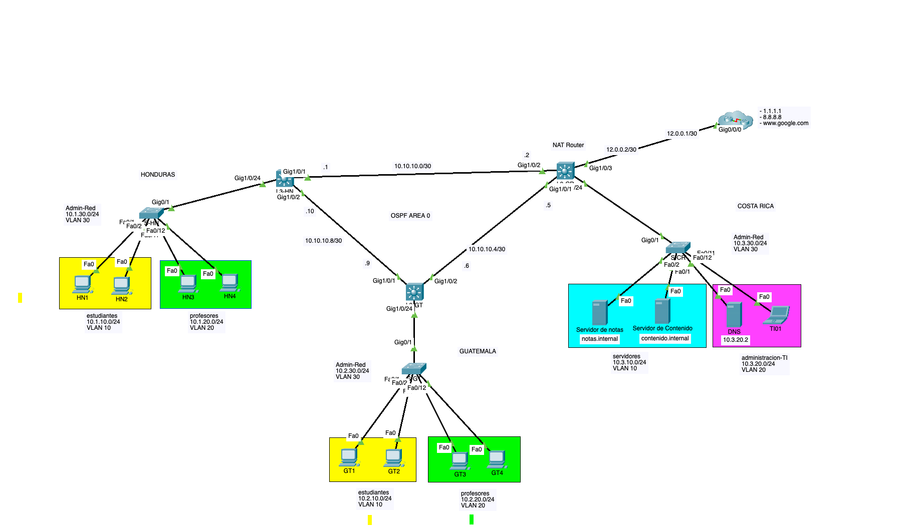
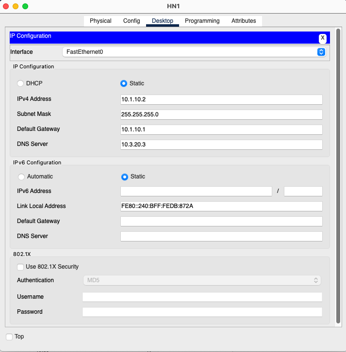

# Laboratorio 10 - CCNA3 - Switch Capa 3 + OSPF + ACLs + NAT

>[!WARNING]
>EN PROGRESO DE FINALIZACION∫Å

## 1. Objetivo

El propósito de este laboratorio es poner en práctica los conocimientos aprendidos sobre enrutamiento inter-VLAN mediante SVI en Switches multicapa, OSPF de una sola área y Listas de Control de Acceso (ACLs) en una red cuya topología representa una situación real.

## 2. Descripción del Escenario

En el siguiente escenario se presenta el diagrama de red de una institución educativa con operaciones en tres países: Guatemala, Honduras y Costa Rica. Cada uno de estos países cuenta con un router que conecta las redes locales a través de enlaces WAN y utilizan OSPF para el enrutamiento entre las distintas localidades.

Tanto en Guatemala como en Honduras, existen dos VLANs: una para estudiantes y otra para profesores. En Costa Rica se encuentran los servidores centrales de la institución y el personal de administración, así como la salida a internet para toda la red.

## 3. Diagrama de Red

  

## 4. Archivo inicial de Packet Tracer

Este es el archivo del laboratorio con la [configuración inicial](labs ccna-lab-10-SVI-OSFP-AC-NAT-init.pkt)

## 5. Detalle de direccionamiento IP y asignación de VLANs

### 5.1. Tabla de VLANs y Subredes Asignadas

| País                   | VLAN    | Red           | Descripción          | Rango de Puertos |
| ---------------------- | ------- | ------------- | -------------------- | ---------------- |
| Guatemala              | VLAN 10 | 10.2.10.0/24  | Estudiantes          | Fa0/1 - Fa0/10   |
| Guatemala              | VLAN 20 | 10.2.20.0/24  | Profesores           | Fa0/11 - Fa0/20  |
| Guatemala              | VLAN 30 | 10.2.30.0/24  | Admin-Red            | N/A              |
| Guatemala              | VLAN 99 | --            | Nativa               | N/A              |
| Honduras               | VLAN 10 | 10.1.10.0/24  | Estudiantes          | Fa0/1 - Fa0/10   |
| Honduras               | VLAN 20 | 10.1.20.0/24  | Profesores           | Fa0/11 - Fa0/20  |
| Honduras               | VLAN 30 | 10.1.30.0/24  | Admin-Red            | N/A              |
| Honduras               | VLAN 99 | --            | Nativa               | N/A              |
| Costa Rica             | VLAN 10 | 10.3.10.0/24  | Servidores           | Fa0/1 - Fa0/10   |
| Costa Rica             | VLAN 20 | 10.3.20.0/24  | Administración       | Fa0/11 - Fa0/20  |
| Costa Rica             | VLAN 30 | 10.3.30.0/24  | Admin-Red            | N/A              |
| Costa Rica             | VLAN 99 | --            | Nativa               | N/A              |
| Guatemala a Honduras   | N/A     | 10.10.10.0/30 | Enlace punto a punto | N/A              |
| Guatemala a Costa Rica | N/A     | 10.10.10.4/30 | Enlace punto a punto | N/A              |
| Honduras a Costa Rica  | N/A     | 10.10.10.8/30 | Enlace punto a punto | N/A              |

### 5.2. Tabla de Asignación de IPs

| Dispositivo      | Interfaz         | IP Address         |
|------------------|------------------|--------------------|
| R-HN             | VLAN10        | 10.1.10.1/24       |
| R-HN             | VLAN20        | 10.1.20.1/24       |
| R-HN             | VLAN30        | 10.1.30.1/24       |
| R-HN             | Se0/1/0          | 10.10.10.1/30      |
| R-HN             | Se0/1/1          | 10.10.10.10/30     |
| R-HN             | Lo0              | 10.1.1.1/32        |
| R-GT             | VLAN10       | 10.2.10.1/24       |
| R-GT             | VLAN20        | 10.2.20.1/24       |
| R-GT             | VLAN30        | 10.2.30.1/24       |
| R-GT             | Se0/1/0          | 10.10.10.9/30      |
| R-GT             | Se0/1/1          | 10.10.10.6/30      |
| R-GT             | Lo0              | 10.1.1.2/32        |
| R-CR             | VLAN10        | 10.3.10.1/24       |
| R-CR             | VLAN20        | 10.3.20.1/24       |
| R-CR             | VLAN30        | 10.3.30.1/24       |
| R-CR             | Se0/1/0          | 10.10.10.5/30      |
| R-CR             | Se0/1/1          | 10.10.10.2/30      |
| R-CR             | Gig0/0/1         | 12.0.0.2/30        |
| R-CR             | Lo0              | 10.1.1.3/32        |
| S-HN             | VLAN 30 SVI      | 10.1.30.2/24       |
| S-GT             | VLAN 30 SVI      | 10.2.30.2/24       |
| S-CR             | VLAN 30 SVI      | 10.3.30.2/24       |
| HN1              | Fa0              | 10.1.10.2/24       |
| HN2              | Fa0              | 10.1.10.3/24       |
| HN3              | Fa0              | 10.1.20.2/24       |
| HN4              | Fa0              | 10.1.20.3/24       |
| GT1              | Fa0              | 10.2.10.2/24       |
| GT2              | Fa0              | 10.2.10.3/24       |
| GT3              | Fa0              | 10.2.20.2/24       |
| GT4              | Fa0              | 10.2.20.3/24       |
| Servidor de Notas| Fa0              | 10.3.10.2/24       |
| Servidor de Contenido| Fa0          | 10.3.10.3/24       |
| TI01             | Fa0              | 10.3.20.2/24       |
| DNS              | Fa0              | 10.3.20.3/24       |

## 6. Instrucciones

### 6.1. Sección 1: Parámetros iniciales
- En todos los dispositivos, configure el nombre de host.
- Configure un mensaje del día (MOTD) que contenga la palabra `advertencia`.
- Proteja el acceso a consola con el password `cisco`.
- Proteja el acceso a modo EXEC privilegiado con el password `class`.
- Encripte las contraseñas en el archivo de configuración.

### 6.2. Sección 2: Acceso por SSH 
- Configure un nombre de dominio `mylab.com`.
- Genere un par de llaves RSA con **1024 bits** para habilitar SSH.
- Cree un usuario `admin` con contraseña segura `letmein` y el **máximo** privilegio.
- Habilite el acceso por SSH en todas las terminales virtuales disponibles, asegúrese de utilizar la base de datos local para la autenticación de usuarios.
- Asegúrese de estar utilizando la versión 2 del protocolo SSH.

### 6.3. Sección 3: Configuración de Enlaces WAN
- Configure las interfaces de los enlaces WAN en los routers de GT, HN y CR de acuerdo a la [Tabla de Asignación de IPs](#tabla-de-asignación-de-ips).
- Agregue una descripción en las interfaces.

### 6.4. Sección 4: VLANs y Puertos de Switch
- Configure las VLANs en S-HN, S-GT y S-CR de acuerdo a la información proporcionada en la [Tabla de VLANs y Subredes Asignadas](#tabla-de-vlans-y-subredes-asignadas).
- Configure los puertos de acceso en S-HN y S-GT según la información proporcionada en la [Tabla de VLANs y Subredes Asignadas](#tabla-de-vlans-y-subredes-asignadas).
- Configure los enlaces troncales en S-HN, S-GT y S-CR de forma estática, de acuerdo con la [Tabla de VLANs y Subredes Asignadas](#tabla-de-vlans-y-subredes-asignadas). ***Únicamente debe permitir el tráfico de las VLANs utilizadas en el ejercicio y rechazar cualquier tráfico que pertenezca a otra VLAN.***
- Habilite las interfaces de administración en S-HN, S-GT y S-CR y asigne las direcciones IP, de acuerdo con la información proporcionada en la [Tabla de Asignación de IPs](#tabla-de-asignación-de-ips).
- Configure lo necesario para que el switch pueda ser alcanzado desde redes externas.

### 6.5. Sección 5: Enrutamiento Inter-VLAN
- Habilite el enrutamiento inter-VLAN en los routers R-HN, R-GT y R-CR mediante la configuración de las subinterfaces correspondientes, según lo indicado en la [Tabla de Asignación de IPs](#tabla-de-asignación-de-ips). No olvide habilitar el enrutamiento IPv4 en los routers.

### 6.6. Sección 6: Direcciones de los Hosts
- Asigne las direcciones IP a las PCs de acuerdo a la información proporcionada en la [Tabla de Asignación de IPs](#tabla-de-asignación-de-ips).
- Asigne como DNS la IP del servidor DNS indicado.

### 6.7. Sección 7: Configuración de OSPF
- Configure OSPF de una sola área en los routers de HN, GT y CR para anunciar todas las redes.
- Utilice el ID de Proceso No. 1.
- Confirme que el router ID asignado sea la IP en la interfaz de loopback.
- Configure las interfaces pasivas para evitar anunciar paquetes OSPF por las interfaces hacia las LAN.

### 6.8. Sección 8: Configuración de Salida a Internet
- Configure la interfaz conectada hacia el ISP con la IP pública asignada.
- Configure una ruta por defecto en R-CR para enviar el tráfico con destino a internet hacia la IP del ISP (12.0.0.1).
- Redistribuya esta ruta por defecto por medio del protocolo OSPF en la única área configurada.

### 6.9. Sección 9: Verificación de Conectividad
- Verifique la conectividad entre los dispositivos en diferentes VLANs y localizaciones.
- Verifique que los hosts de GT y HN obtengan respuesta de las IPs de internet 1.1.1.1 y 8.8.8.8.
- Verifique que los hosts de GT y HN puedan acceder por medio del explorador a www.google.com.
- Pruebe el acceso por SSH a los dispositivos de red.

### 6.10. Sección 10: Políticas de Seguridad mediante ACLs
- Ahora que ha probado la conectividad en toda la red, implemente las siguientes políticas de seguridad mediante la configuración de Listas de Control de Acceso en los Routers GT, HN y CR:
  1. No permitir que las redes de estudiantes tengan conectividad con los profesores.
  2. Los profesores pueden acceder al Servidor de Notas solo por FTP.
  3. Los estudiantes pueden acceder al Servidor de Notas solo por HTTP y HTTPS.
  4. Solo los profesores pueden acceder al Servidor de Contenido y solo por HTTP y HTTPS.
  5. No permitir que los profesores ni los estudiantes tengan conectividad con la red de Administración-TI.
  6. Solo los profesores pueden salir a internet.
  7. Solo la PC TI01 puede acceder por SSH a los dispositivos de red.


## 7. Resolución Paso a Paso

- Instalar las fuentes de energia en los switches L3

### 7.1.  Parametros iniciales

> Repetir en todos los dispositivos de red, unicamente modificando el `hostname`

```
hostname L3-CR
banner motd "advertencia: acceso restringido"
line console 0 
password cisco
login
exit
enable secret class
service password-encryption 
```

### 7.2. Acceso por SSH

> Repetir en todos los dispositivos de red

```
ip domain-name mylab.com
crypto key generate rsa
1024
username admin secret letmein
username admin privilege 15
line vty 0 15
login local
transport input ssh
exit
ip ssh version 2
no ip domain-lookup
```

### 7.3.  Configuración de Enlaces WAN

#### 7.3.1. L3-HN (HONDURAS)

```
ip routing
interface G1/0/1
no switchport
description enlace Honduras-Costa Rica
ip address 10.10.10.1 255.255.255.252
no shutdown
exit
interface G1/0/2
no switchport
description enlace Honduras-Guatemala
ip address 10.10.10.10 255.255.255.252
no shutdown
exit
```

#### 7.3.2. L3-GT (GUATEMALA)
```
ip routing
interface G1/0/1
no switchport
description enlace Honduras-Guatemala
ip address 10.10.10.9 255.255.255.252
no shutdown
interface G1/0/2
no switchport
description enlace Guatemala-CostaRica
ip address 10.10.10.6 255.255.255.252
no shutdown
exit
```

#### 7.3.3. L3-CR (Costa Rica)
```
ip routing
interface G1/0/1
no switchport
description enlace Guatemala-CostaRica
ip address 10.10.10.5 255.255.255.252
no shutdown
interface G1/0/2
no switchport
description enlace Honduras-Costa Rica
ip address 10.10.10.2 255.255.255.252
no shutdown
exit
```

### 7.4. Configuración de VLANs y Puertos de Switch

#### 7.4.1 Declarar las VLANs en todos los Switch

Switches S-HN, S-GT, L3-HN, L3-GT:

```
vlan 10
name estudiantes
vlan 20
name profesores
vlan 30
name Admin-Red
exit
```

Switch S-CR, L3-CR:

```
vlan 10
name servidores
vlan 20
name administracion-TI
vlan 30
name Admin-Red
exit
```

#### 7.4.2 Asignación de puertos de acceso

Configurar en todos los switches de acceso:

```
interface range f0/1-10
switchport mode access
switchport access vlan 10
exit
interface range f0/11-20
switchport mode access
switchport access vlan 20
exit
interface range f0/21-24
shutdown
exit
```

#### 7.4.3 Configuración de puerto troncal en switches

Configurar en todos los switches de acceso:

```
interface g0/1
switchport mode trunk 
switchport trunk allowed vlan 10,20,30
switchport trunk native vlan 99
switchport nonegotiate 
exit
```

Configurar en todos los switches de distribucion/core:

```
interface g1/0/24
switchport mode trunk 
switchport trunk allowed vlan 10,20,30
switchport trunk native vlan 99
switchport nonegotiate 
exit
```


#### 7.4.4. Configuracion de SVI para administracion del switch

Switch Honduras (S-HN):

```
interface vlan 30
ip address 10.1.30.2 255.255.255.0
exit
ip default-gateway 10.1.30.1
```

Switch Guatemala (S-GT):

```
interface vlan 30
ip address 10.2.30.2 255.255.255.0
exit
ip default-gateway 10.2.30.1
```

Switch Costa Rica (S-CR):

```
interface vlan 30
ip address 10.3.30.2 255.255.255.0
exit
ip default-gateway 10.3.30.1
```

### 7.5. Enrutamiento Inter-VLAN por medio de SVI's

#### 7.5.1. L3-HN (Honduras)

```
interface vlan10
description estudiantes-honduras
ip address 10.1.10.1 255.255.255.0
no shutdown
exit

interface vlan20
description profesores-honduras
ip address 10.1.20.1 255.255.255.0
exit

interface vlan30
description adminred-honduras
ip address 10.1.30.1 255.255.255.0
exit
```

#### 7.5.2. L3-GT (Guatemala)

```
interface vlan10
description estudiantes-guatemala
ip address 10.2.10.1 255.255.255.0
no shutdown
exit

interface vlan20
description profesores-guatemala
ip address 10.2.20.1 255.255.255.0
no shutdown
exit

interface vlan30
description adminred-guatemala
ip address 10.2.30.1 255.255.255.0
no shutdown
exit

```

#### 7.5.3. L3-CR (Costa Rica)

```
interface vlan10
description servidores-costarica
ip address 10.3.10.1 255.255.255.0
no shutdown
exit

interface vlan20
description AdministracionTI-costarica
ip address 10.3.20.1 255.255.255.0
no shutdown
exit

interface vlan30
description adminred-costarica
ip address 10.3.30.1 255.255.255.0
no shutdown
exit

```

### 7.6. Direcciones de los Hosts

Configurar los host de acuerdo a las instrucciónes, ejemplo: HN1

  

### 7.7. Configuración de OSPF
#### 7.7.1 L3-HN (Honduras)

```
interface lo0
ip address 10.1.1.1 255.255.255.255
exit
router ospf 1
network 10.10.10.0 0.0.0.3 area 0
network 10.10.10.8 0.0.0.3 area 0
network 10.1.10.0 0.0.0.255 area 0
network 10.1.20.0 0.0.0.255 area 0
network 10.1.30.0 0.0.0.255 area 0
passive-interface vlan10
passive-interface vlan20
passive-interface vlan30
exit

interface range g1/0/1-2
ip ospf network point-to-point
exit

```
#### 7.7.2 L3-GT (Guatemala)

```
interface lo0
ip address 10.1.1.2 255.255.255.255
exit

router ospf 1
exit

interface range g1/0/1-2
ip ospf 1 area 0
ip ospf network point-to-point
interface vlan10
ip ospf 1 area 0
interface vlan20
ip ospf 1 area 0
interface vlan30
ip ospf 1 area 0
exit

router ospf 1
passive-interface vlan10
passive-interface vlan20
passive-interface vlan30
exit

```
#### 7.7.3 L3-CR (Costa Rica)

```
interface lo0
ip address 10.1.1.3 255.255.255.255
exit

router ospf 1
exit

interface range g1/0/1-2
ip ospf 1 area 0
ip ospf network point-to-point
interface vlan10
ip ospf 1 area 0
interface vlan20
ip ospf 1 area 0
interface vlan30
ip ospf 1 area 0
exit

router ospf 1
passive-interface vlan10
passive-interface vlan20
passive-interface vlan30
exit

```

### 7.8. Configuración de Salida a Internet

Configuración unicamente en el Switch Capa 3 de Costa Rica (R-CR):

```
interface g1/0/3
no switchport
description conexion-ISP
ip address 12.0.0.2 255.255.255.252
no shutdown
exit
ip route 0.0.0.0 0.0.0.0 12.0.0.1
router ospf 1
default-information originate 
```

### 7.9 Políticas de Seguridad mediante ACLs

#### 7.9.1 ACL Estudiantes Honduras

 **Definición de la ACL en L3-HN**
```
ip access-list extended EST-HN
remark "Denegar trafico de Estudiantes HN hacia Profesores HN y GT"
deny ip 10.1.10.0 0.0.0.255 10.1.20.0 0.0.0.255
deny ip 10.1.10.0 0.0.0.255 10.2.20.0 0.0.0.255
remark "Permitir comunicacion con Servidor de Notas solo por HTTP y HTTPs"
permit tcp 10.1.10.0 0.0.0.255 host 10.3.10.2 eq www
permit tcp 10.1.10.0 0.0.0.255 host 10.3.10.2 eq 443
deny ip 10.1.10.0 0.0.0.255 host 10.3.10.2
remark "Denegar la comunicacion con el Servidor de Contenido"
deny ip 10.1.10.0 0.0.0.255 host 10.3.10.3
remark "Denegar la comunicacion con la red de Administración-TI"
deny ip 10.1.10.0 0.0.0.255 10.3.20.0 0.0.0.255 
remark "Permitir el trafico INTERNO restante"
permit ip 10.1.10.0 0.0.0.255 10.0.0.0 0.255.255.255
exit
```
**Asignación a la interfaz (inbound) en L3-HN**

```
interface vlan10
ip access-group EST-HN in
exit
```

#### 7.9.2. ACL Profesores Honduras

**Definición de la ACL en L3-HN**

```
ip access-list extended PRO-HN
remark "Permitir trafico hacia el Servidor de Notas solo por FTP"
permit tcp any host 10.3.10.2 eq 21
permit tcp any host 10.3.10.2 range 1023 65535
deny ip any host 10.3.10.2
remark "Permitir trafico hacia el Servidor de Contenido solo por HTTP y HTTPS"
permit tcp any host 10.3.10.3 eq www
permit tcp any host 10.3.10.3 eq 443
deny ip any host 10.3.10.3
remark "Denegar la comunicacion con la red de Administración-TI"
deny ip any 10.3.20.0 0.0.0.255 
remark "Permitir el trafico restante"
permit ip any any
exit
```

**Asignación de la ACL a la interfaz (inbound) en L3-HN**
```
interface vlan20
ip access-group PRO-HN in
exit
```

#### 7.9.3 ACL Estudiantes Guatemala

 **Definición de la ACL en R-GT**
 ```
ip access-list extended EST-GT
remark "Denegar trafico de Estudiantes GT hacia Profesores HN y GT"
deny ip any 10.1.20.0 0.0.0.255
deny ip any 10.2.20.0 0.0.0.255
remark "Permitir comunicacion con Servidor de Notas solo por HTTP y HTTPs"
permit tcp any host 10.3.10.2 eq www
permit tcp any host 10.3.10.2 eq 443
deny ip any host 10.3.10.2
remark "Denegar la comunicacion con el Servidor de Contenido"
deny ip any host 10.3.10.3
remark "Denegar la comunicacion con la red de Administración-TI"
deny ip any 10.3.20.0 0.0.0.255 
remark "Permitir el trafico INTERNO restante"
permit ip any 10.0.0.0 0.255.255.255
exit
```

**Asignación a la interfaz (inbound) en L3-GT**
```
interface vlan10
ip access-group EST-GT in
exit
```

#### 7.9.4. ACL Profesores Guatemala

**Definición de la ACL en R-GT**

```
ip access-list extended PRO-GT
remark "Permitir trafico hacia el Servidor de Notas solo por FTP"
permit tcp any host 10.3.10.2 eq 21
permit tcp any host 10.3.10.2 range 1023 65535
deny ip any host 10.3.10.2
remark "Permitir trafico hacia el Servidor de Contenido solo por HTTP y HTTPS"
permit tcp any host 10.3.10.3 eq www
permit tcp any host 10.3.10.3 eq 443
deny ip any host 10.3.10.3
remark "Denegar la comunicacion con la red de Administración-TI"
deny ip any 10.3.20.0 0.0.0.255 
remark "Permitir el trafico restante"
permit ip any any
exit
```

**Asignación de la ACL a la interfaz (inbound) en L3-GT**
```
interface vlan20
ip access-group PRO-GT in
exit
```

#### 7.9.5. ACLs Administración Equipos de Red

```
ip access-list standard MGMT
permit host 10.3.20.3
exit
line vty 0 15
access-class MGMT in 
```

#### 7.10 Configuración de NAT en L3-CR

Instrucciones:
Configurar NAT con sobrecarga, con el siguiente pool de IPs públicas
- 14.1.1.1 hasta la 14.1.1.5 

>[!IMPORTANT]
>ESTA PARTE NO LA SOPORTA LA VERSION ACTUAL DE PACKET TRACER EN SWITCHES MULTICAPA

```
access-list 1 permit 10.1.0.0 0.0.0.255
access-list 1 permit 10.2.0.0 0.0.0.255
access-list 1 permit 10.3.0.0 0.0.0.255
ip nat pool PUBLICAS 14.1.1.1 14.1.1.5 netmask 255.255.255.248
ip nat inside source list 1 pool PUBLICAS overload

interface G1/0/2
ip nat inside
interface G1/0/1
ip nat inside
interface vlan10
ip nat inside
interface vlan20
ip nat inside
interface vlan30
ip nat inside
interface Gi1/0/3
ip nat oustide
exit


> [!IMPORTANT]
>
> !Has completado el laboratorio, espero te sirva en tu proceso de aprendizaje en redes! (

[Archivo con Laboratorio resuleto](labs/ccna-lab-10-SVI-OSFP-AC-NAT-final.pkt)


