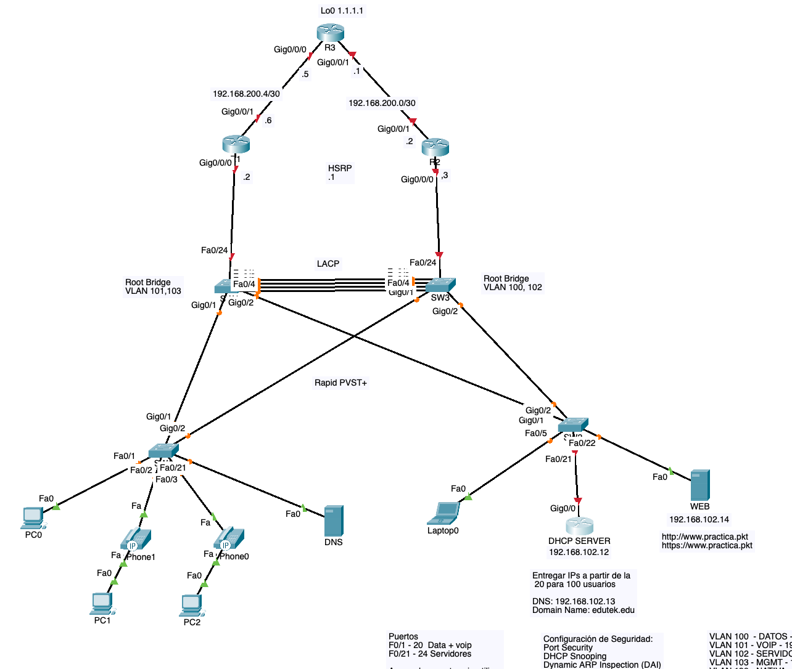

# Laboratorio 11 - CCNA2

Temas Cubiertos:

- Intervlan Routing con Sub-interfaces
- Etherchannel
- Voice VLAN
- Spanning Tree (Portfast, BPDU Guard)
- HSRP
- DHCP Server
- Port Security
- DHCP Snooping
- ARP Dynamic Inspection

## Topologia de Red



## LAboratorio de Packet Tracer

[Este es el laboratorio con la configuración inicial](labs/11-ccna-lav-integracion-ccna2.pkt)

## SW1 (Switch Acceso)

### Configuración general
```
hostname SW1
enable secret cisco
line console 0
password cisco
login
exit
service password-encryption
ip domain-name edutek.edu
crypto key generate rsa
1024
ip ssh version 2
username admin secret cisco
username admin privilege 15
line vty 0 15
login local
transport input ssh
exit
no ip domain-lookup
````

### Configuración de VLANS y puertos de acceso

```
vlan 100
name datos
vlan 101
name voip
vlan 102
name servidores
vlan 103
name mgmt
vlan 198
name nativa
vlan 199
name dummy
exit
````

```
interface range f0/1-20
description pc_telefono
switchport mode access
switchport access vlan 100
switchport voice vlan 101
exit
interface range f0/21-24
description servidores
switchport mode access
switchport access vlan 102
exit
```

#### Apagamos los puertos sin utilizar y los metemos a una vlan dummy

```
interface range f0/4-20,f0/22-24
shutdown
switchport access vlan 199
exit
```

### Configuración de puertos troncales

```
interface range G0/1-2
description troncal-ascendente
switchport mode trunk
switchport trunk native vlan 198
switchport trunk allowed vlan 100-103
switchport nonegotiate
exit
```

## Configuración de Spanning Tree, Portfast y BPDU Guard

```
spanning-tree mode rapid-pvst
interface range f0/1-24
spanning-tree bpduguard enable 
spanning-tree portfast 
exit
```

## Configuracion de Port Security

#### Puertos con PC y Telefono
```
interface range f0/1-20
switchport port-security
switchport port-security maximum 3
switchport port-security mac-address sticky 
exit
```

#### Puertos solo con un PC
```
interface range f0/21-24
switchport port-security
switchport port-security mac-address sticky 
exit
```

## Configuracion de DHCP Snooping

```
ip dhcp snooping 
ip dhcp snooping vlan 100-103

interface range g0/1-2
ip dhcp snooping trust
exit

interface range f0/1-24
ip dhcp snooping limit rate 50
exit
```

## Configuracion de DAI (Dynami ARP Inspection)

```
ip arp inspection vlan 100-103
ip arp inspection validate src-mac dst-mac ip

interface range g0/1-2
ip arp inspection trust
exit
```

## SW2 (Switch Acceso)

### Configuración general

```
hostname SW2
enable secret cisco
line console 0
password cisco
login
exit
service password-encryption
ip domain-name edutek.edu
crypto key generate rsa
1024
ip ssh version 2
username admin secret cisco
username admin privilege 15
line vty 0 15
login local
transport input ssh
exit
no ip domain-lookup
```

### Configuración de VLANs y puertos de acceso

```
vlan 100
name datos
vlan 101
name voip
vlan 102
name servidores
vlan 103
name mgmt
vlan 198
name nativa
vlan 199
name dummy
exit
```

```
interface range f0/1-20
description pc_telefono
switchport mode access
switchport access vlan 100
switchport voice vlan 101
exit
interface range f0/22-24
description servidores
switchport mode access
switchport access vlan 102
exit
```

#### Apagamos los puertos sin utilizar y los metemos a una vlan dummy

```
interface range f0/1-4,f0/6-20,f0/23-24
shutdown
switchport access vlan 199
exit
```

### Configuración de puertos troncales

```
interface range G0/1-2
description troncal-ascendente
switchport mode trunk
switchport trunk native vlan 198
switchport trunk allowed vlan 100-103
switchport nonegotiate
exit
```

```
interface F0/21
description troncal-hacia-DHCP-Server
switchport mode trunk
switchport trunk native vlan 198
switchport trunk allowed vlan 100-103
switchport nonegotiate
exit
```

## Configuración de Spanning Tree, Portfast y BPDU Guard

```
spanning-tree mode rapid-pvst
interface range f0/1-24
spanning-tree bpduguard enable 
spanning-tree portfast 
exit
```

## Configuracion de Port Security

```
interface range f0/1-20
switchport port-security
switchport port-security maximum 3
switchport port-security mac-address sticky 
exit

interface range f0/22-24
switchport port-security
switchport port-security mac-address sticky 
exit
````

## Configuracion de DHCP Snooping

```
ip dhcp snooping 
ip dhcp snooping vlan 100-103

interface range g0/1-2,f0/21
ip dhcp snooping trust
exit

interface range f0/1-24
ip dhcp snooping limit rate 50
exit
```

## Configuracion de DAI (Dynami ARP Inspection)

```
ip arp inspection vlan 100-103
ip arp inspection validate src-mac dst-mac ip

interface range g0/1-2,f0/21
ip arp inspection trust
exit
```


## SW3 (Switch Distribucion)

### Configuración general

```
hostname SW3
enable secret cisco
line console 0
password cisco
login
exit
service password-encryption
ip domain-name edutek.edu
crypto key generate rsa
1024
ip ssh version 2
username admin secret cisco
username admin privilege 15
line vty 0 15
login local
transport input ssh
exit
no ip domain-lookup
````

### Configuración de VLANs

```
vlan 100
name datos
vlan 101
name voip
vlan 102
name servidores
vlan 103
name mgmt
vlan 198
name nativa
vlan 199
name dummy
exit
````
#### Apagamos los puertos sin utilizar y los metemos a una vlan dummy


```
interface range f0/5-23
switchport mode access
switchport access vlan 199
shutdown
exit
```

### Enlaces Troncales

```
interface range f0/1-4,g0/1-2,f0/24
description troncal
switchport mode trunk
switchport trunk native vlan 198
switchport trunk allowed vlan 100-103
switchport nonegotiate
exit
```

### Configuración de Etherchannel (LACP)

```
interface range f0/1-4
channel-group 1 mode active
exit

interface po1
switchport mode trunk
switchport trunk native vlan 198
switchport trunk allowed vlan 100-103
exit
```

## Configuración de Spanning Tree, y Root Bridges

```
spanning-tree mode rapid-pvst
spanning-tree vlan 100,102 root primary 
spanning-tree vlan 101,103 root secondary
```

## SW4 (Switch Distribucion)

### Configuración general

```
hostname SW4
enable secret cisco
line console 0
password cisco
login
exit
service password-encryption
ip domain-name edutek.edu
crypto key generate rsa
1024
ip ssh version 2
username admin secret cisco
username admin privilege 15
line vty 0 15
login local
transport input ssh
exit
no ip domain-lookup
````

### Configuración de VLANs

```
vlan 100
name datos
vlan 101
name voip
vlan 102
name servidores
vlan 103
name mgmt
vlan 198
name nativa
vlan 199
name dummy
exit
````

#### Apagamos los puertos sin utilizar y los metemos a una vlan dummy

```
interface range f0/5-23
switchport mode access
switchport access vlan 199
shutdown
exit
````
### Enlaces Troncales

```
interface range f0/1-4,g0/1-2,f0/24
description troncal
switchport mode trunk
switchport trunk native vlan 198
switchport trunk allowed vlan 100-103
switchport nonegotiate
exit
````

### Configuración de Etherchannel (LACP)

```
interface range f0/1-4
channel-group 1 mode active
exit

interface po1
switchport mode trunk
switchport trunk native vlan 198
switchport trunk allowed vlan 100-103
exit
````

## Configuración de Spanning Tree y Root Bridge

````
spanning-tree mode rapid-pvst
spanning-tree vlan 101,103 root primary
spanning-tree vlan 100,102 root secondary 
````

## R1 (Router)

### Configuración General

```
hostname R1
enable secret cisco
line console 0
password cisco
login
exit
service password-encryption
ip domain-name edutek.edu
crypto key generate rsa
1024
ip ssh version 2
username admin secret cisco
username admin privilege 15
line vty 0 15
login local
transport input ssh
exit
no ip domain-lookup
```

### Configuración de sub-interfaces

```
interface g0/0/0.100
encapsulation dot1q 100
ip address 192.168.100.2 255.255.255.0
exit
interface g0/0/0.101
encapsulation dot1q 101
ip address 192.168.101.2 255.255.255.0
exit
interface g0/0/0.102
encapsulation dot1q 102
ip address 192.168.102.2 255.255.255.0
exit
interface g0/0/0.103
encapsulation dot1q 103
ip address 192.168.103.2 255.255.255.0
exit
interface g0/0/0
no shutdown
exit
````

### Enlace WAN hacia R3

```
interface g0/0/1  
description to-R3 
ip address 192.168.200.6 255.255.255.252
no shutdown
```

### Ruta estática por defecto
```
ip route 0.0.0.0 0.0.0.0 192.168.200.5
````

### Configuración de HSRP
```
interface g0/0/0.100
standby 100 ip 192.168.100.1
standby 100 priority 150
standby 100 preempt 
exit

interface g0/0/0.101
standby 101 ip 192.168.101.1
exit

interface g0/0/0.102
standby 102 ip 192.168.102.1
standby 102 priority 150
standby 102 preempt 
exit

interface g0/0/0.103
standby 103 ip 192.168.103.1
exit
```


## R2 (Router)

### Configuración General
```
hostname R2
enable secret cisco
line console 0
password cisco
login
exit
service password-encryption
ip domain-name edutek.edu
crypto key generate rsa
1024
ip ssh version 2
username admin secret cisco
username admin privilege 15
line vty 0 15
login local
transport input ssh
exit
no ip domain-lookup
```

### Configuración de interfaces

```
interface g0/0/0.100
encapsulation dot1q 100
ip address 192.168.100.3 255.255.255.0
exit
interface g0/0/0.101
encapsulation dot1q 101
ip address 192.168.101.3 255.255.255.0
exit
interface g0/0/0.102
encapsulation dot1q 102
ip address 192.168.102.3 255.255.255.0
exit
interface g0/0/0.103
encapsulation dot1q 103
ip address 192.168.103.3 255.255.255.0
exit
interface g0/0/0
no shutdown
exit
```

### Configuración de HSRP
```
interface g0/0/0.100
standby 100 ip 192.168.100.1
exit

interface g0/0/0.101
standby 101 ip 192.168.101.1
standby 101 priority 150
standby 101 preempt 
exit

interface g0/0/0.102
standby 102 ip 192.168.102.1 
exit

interface g0/0/0.103
standby 103 ip 192.168.103.1 
standby 103 priority 150
standby 103 preempt 
exit
```

### Enlace WAN hacia R3

```
interface g0/0/1  
description to-R3 
ip address 192.168.200.2 255.255.255.252
no shutdown
````

### Ruta estática por defecto
```
ip route 0.0.0.0 0.0.0.0 192.168.200.1
```

## R3(Router)

### Configuración General
```
hostname R3
enable secret cisco
line console 0
password cisco
login
exit
service password-encryption
ip domain-name edutek.edu
crypto key generate rsa
1024
ip ssh version 2
username admin secret cisco
username admin privilege 15
line vty 0 15
login local
transport input ssh
exit
no ip domain-lookup
````
### Configuraicón de interfaces

```
interface g0/0/0
ip address 192.168.200.5 255.255.255.252
no shutdown

interface g0/0/1
ip address 192.168.200.1 255.255.255.252
no shutdown

interface lo0
ip address 1.1.1.1 255.255.255.255
````

### Rutas estáticas por defecto

```
ip route 0.0.0.0 0.0.0.0 192.168.200.6
ip route 0.0.0.0 0.0.0.0 192.168.200.2
```
## Router (DCHP-SERVER)

```
interface g0/0.100
encapsulation dot1q 100
ip address 192.168.100.12 255.255.255.0
exit
interface g0/0.101
encapsulation dot1q 101
ip address 192.168.101.12 255.255.255.0
exit
interface g0/0.102
encapsulation dot1q 102
ip address 192.168.102.12 255.255.255.0
exit
interface g0/0.103
encapsulation dot1q 103
ip address 192.168.103.12 255.255.255.0
exit
interface g0/0
no shutdown
exit
````
### Configuración de DHCP Server
```
ip dhcp relay information trust-all

ip dhcp excluded-address 192.168.100.1 192.168.100.19
ip dhcp excluded-address 192.168.100.120 192.168.100.254

ip dhcp excluded-address 192.168.101.1 192.168.101.19
ip dhcp excluded-address 192.168.101.120 192.168.101.254

ip dhcp excluded-address 192.168.102.1 192.168.102.19
ip dhcp excluded-address 192.168.102.120 192.168.102.254

ip dhcp excluded-address 192.168.103.1 192.168.103.19
ip dhcp excluded-address 192.168.103.120 192.168.103.254

ip dhcp pool VLAN100
network 192.168.100.0 255.255.255.0
dns-server 192.168.102.13
default-router 192.168.100.1
domain-name edutek.edu
exit

ip dhcp pool VLAN101
network 192.168.101.0 255.255.255.0
dns-server 192.168.102.13
default-router 192.168.101.1
domain-name edutek.edu
exit

ip dhcp pool VLAN102
network 192.168.102.0 255.255.255.0
dns-server 192.168.102.13
default-router 192.168.102.1
domain-name edutek.edu
exit

ip dhcp pool VLAN103
network 192.168.103.0 255.255.255.0
dns-server 192.168.102.13
default-router 192.168.103.1
domain-name edutek.edu
exit
````


